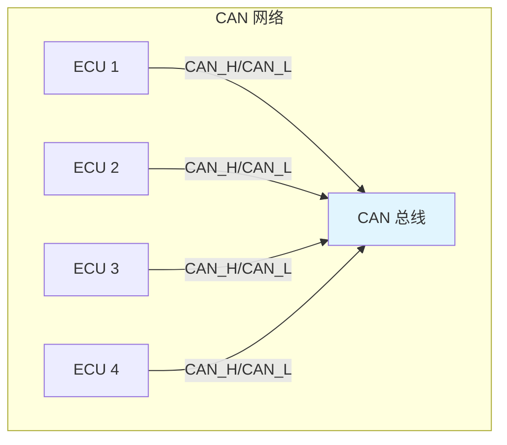
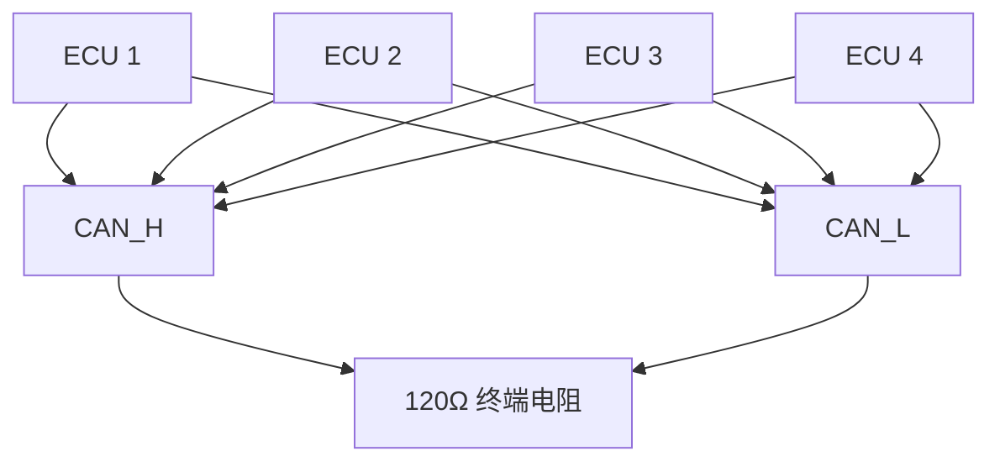

# CAN 协议基础

本章介绍 CAN 总线的基本概念、发展历史和核心特性，是理解 CAN 协议栈的根基。

---

## 1.1 CAN 总线简介

CAN（Controller Area Network）是一种多主方式的串行通信总线，最初由德国 Bosch 公司在 1986 年开发，用于汽车电子系统之间的通信。CAN 总线因其高可靠性、实时性和灵活性，广泛应用于工业自动化、汽车电子、船舶电子等领域。



**核心特性**：

- **多主通信**：所有节点都可以作为主设备发起通信
- **差分信号**：使用 CAN_H 和 CAN_L 两条差分线，抗干扰能力强
- **优先级仲裁**：通过 ID 决定消息优先级，高优先级 ID 优先发送
- **错误检测**：具有强大的错误检测和错误处理机制
- **高速传输**：最高支持 1Mbps（经典 CAN），CANFD 可达 8Mbps

---

## 1.2 CAN 总线发展历史

| 年份 | 版本 | 特性 |
|------|------|------|
| 1986 | CAN 1.0 | Bosch 发布 CAN 协议 |
| 1991 | CAN 2.0 | 发布 CAN 2.0A（标准帧）和 CAN 2.0B（扩展帧） |
| 1993 | ISO 11898 | CAN 总线标准化（ISO 11898-1 数据链路层） |
| 2012 | CAN FD 1.0 | Bosch 发布 CANFD 协议，速率可达 8Mbps |
| 2015 | ISO 11898-1:2015 | CANFD 标准化 |
| 2023 | CAN XL | 最新一代 CAN，支持超过 10Mbps |

---

## 1.3 CAN 总线物理层

### 1.3.1 电气特性

CAN 总线采用差分信号传输，定义了两条信号线：

- **CAN_H**（CAN High）：高电平线
- **CAN_L**（CAN Low）：低电平线

```mermaid
flowchart LR
    subgraph 隐性电平 (Recessive)
        A[CAN_H] ---|2.5V| B[终端电阻]
        C[CAN_L] ---|2.5V| B
    end

    subgraph 显性电平 (Dominant)
        D[CAN_H] ---|3.5V| E[终端电阻]
        F[CAN_L] ---|1.5V| E
    end

    style A fill:#e8f5e9
    style D fill:#ffebee
```

| 电平类型 | CAN_H 电压 | CAN_L 电压 | 差分电压 |
|----------|------------|------------|----------|
| 隐性 (1) | 2.5V | 2.5V | 0V |
| 显性 (0) | 3.5V | 1.5V | 2V |

**关键点**：
- 显性电平优先级高于隐性电平
- 当至少一个节点发送显性电平时，总线电平被拉低
- 终端电阻通常为 120Ω（典型值）

### 1.3.2 总线拓扑



- **总线长度**：最大 40 米（1Mbps）
- **节点数量**：最多 2032 个（理论值，实际受驱动能力限制）
- **布线方式**：总线式拓扑，两端需接终端电阻

---

## 1.4 CAN 总线应用场景

| 领域 | 典型应用 |
|------|----------|
| 汽车电子 | 发动机控制单元、车身控制、仪表盘、车载娱乐系统 |
| 工业自动化 | PLC 通信、机器人控制、变频器、工业现场总线 |
| 船舶电子 | 船舶控制系统、导航设备、通信系统 |
| 医疗设备 | 医疗仪器之间的通信、控制系统 |
| 轨道交通 | 列车控制系统、信号设备通信 |

---

## 1.5 CAN 与其他总线的对比

| 特性 | CAN | LIN | FlexRay | Ethernet |
|------|-----|-----|---------|----------|
| 速率 | 1Mbps | 20Kbps | 10Mbps | 100Mbps+ |
| 拓扑 | 总线式 | 总线式 | 星型/混合 | 星型 |
| 确定性 | 好 | 一般 | 优秀 | 一般 |
| 成本 | 中 | 低 | 高 | 高 |
| 复杂性 | 中 | 低 | 高 | 高 |

---

## 面试题

### Q1: CAN 总线为什么采用差分信号？

**参考答案**：
1. **抗干扰能力强**：差分信号可以有效抑制共模干扰，因为干扰会同时影响两条线，差分运算后可消除
2. **可靠性高**：即使线路受到干扰，两根线的电位同时变化，差值基本不变
3. **适合长距离传输**：差分信号的传输特性使得长距离传输更稳定

### Q2: CAN 总线的显性电平和隐性电平是什么意思？

**参考答案**：
- **隐性电平（Recessive）**：逻辑"1"，CAN_H 和 CAN_L 都是 2.5V，差分电压为 0V
- **显性电平（Dominant）**：逻辑"0"，CAN_H 为 3.5V，CAN_L 为 1.5V，差分电压为 2V
- 显性电平会覆盖隐性电平，这是 CAN 总线仲裁机制的基础

### Q3: CAN 总线最多可以连接多少个节点？

**参考答案**：
- 理论上一个 CAN 总线最多可以连接 2032 个节点（11 位 ID）
- 实际连接数量受到以下因素限制：
  - CAN 驱动器的驱动能力
  - 总线负载率（一般不超过 30%）
  - 终端电阻的匹配
  - 布线长度和布局
