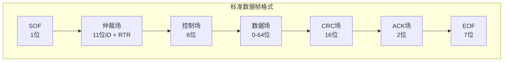
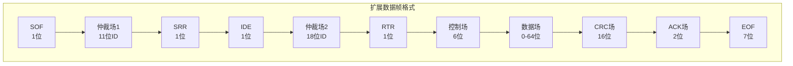
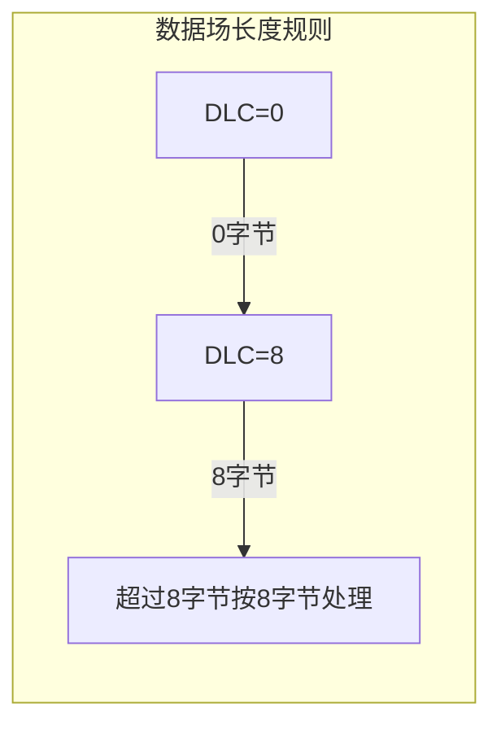
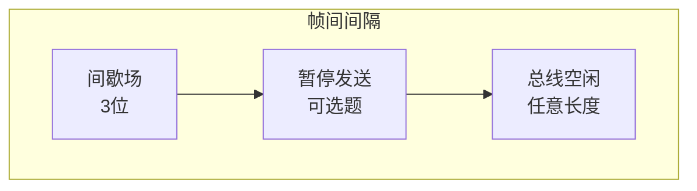

# CAN 帧结构详解

本章详细介绍 CAN 协议的帧结构，包括标准帧、扩展帧以及不同类型的帧（数据帧、远程帧、错误帧、过载帧）。

---

## 2.1 帧类型概述

CAN 协议定义了以下几种帧类型：

| 帧类型 | 用途 | 标识符长度 |
|--------|------|------------|
| 数据帧 | 发送数据 | 11位（标准帧）/29位（扩展帧） |
| 远程帧 | 请求数据 | 11位（标准帧）/29位（扩展帧） |
| 错误帧 | 报告错误 | 无 |
| 过载帧 | 延迟下一个帧 | 无 |
| 间隔帧 | 帧之间间隔 | 无 |

---

## 2.2 数据帧结构

数据帧是 CAN 总线中最常用的帧类型，用于携带数据从发送节点到接收节点。

### 2.2.1 标准数据帧（11位 ID）

| 字段 | 长度 | 说明 |
|------|------|------|
| SOF | 1位 | 帧起始位，显性电平（0） |
| 仲裁场 | 12位 | 11位 ID + RTR 位 |
| 控制场 | 6位 | IDE + r0 + DLC（4位） |
| 数据场 | 0-64位 | 实际传输的数据 |
| CRC 场 | 16位 | 15位 CRC + 1位分隔符 |
| ACK 场 | 2位 | ACK 槽 + ACK 分隔符 |
| EOF | 7位 | 帧结束位 |

### 2.2.2 扩展数据帧（29位 ID）

**扩展帧与标准帧的区别**：

| 字段 | 标准帧 | 扩展帧 |
|------|--------|--------|
| ID 长度 | 11位 | 29位（11位 + 18位） |
| 仲裁场 | 12位 | 32位 |
| SRR 位 | 无 | 1位（替代 RTR） |
| IDE 位 | 1位（在控制场） | 1位（在仲裁场） |

### 2.2.3 关键控制位说明

| 位 | 名称 | 说明 |
|----|------|------|
| RTR | 远程传输请求位 | 0 = 数据帧，1 = 远程帧 |
| IDE | 标识符扩展位 | 0 = 标准帧，1 = 扩展帧 |
| SRR | 替代远程请求位 | 扩展帧中替代 RTR |
| DLC | 数据长度代码 | 0-8，表示数据字节数 |

---

## 2.3 远程帧

远程帧用于请求其他节点发送数据，结构与数据帧相似，但数据场为空。

### 远程帧格式

| 字段 | 标准帧 | 扩展帧 |
|------|--------|--------|
| SOF | 1位 | 1位 |
| 仲裁场 | 11位 ID + RTR(1) | 32位 ID + SRR + IDE + RTR(1) |
| 控制场 | 6位 | 6位 |
| 数据场 | 无 | 无 |
| CRC 场 | 16位 | 16位 |
| ACK 场 | 2位 | 2位 |
| EOF | 7位 | 7位 |

**注意**：RTR 位在远程帧中为"1"（隐性电平）

---

## 2.4 错误帧

错误帧在检测到错误时由任何节点发送，用于通知其他节点发生了错误。

### 错误帧结构

**错误标志**：
- **主动错误标志**：6位显性电平（0）- 处于主动错误状态的节点发送
- **被动错误标志**：6位隐性电平（1）- 处于被动错误状态的节点发送

**错误分隔符**：8位隐性电平，用于分隔错误标志和后续帧

### 错误类型

| 错误类型 | 说明 |
|----------|------|
| 位错误 | 发送的位与监视的位不一致（仲裁场和 ACK 槽除外） |
| 位填充错误 | 违反位填充规则 |
| CRC 错误 | 接收的 CRC 与计算的不一致 |
| 格式错误 | 帧格式不符合规范 |
| ACK 错误 | 发送节点未收到 ACK |

---

## 2.5 过载帧

过载帧用于延迟下一个数据帧或远程帧的发送。

### 过载帧格式

**触发条件**：
1. 接收节点尚未准备好接收下一帧
2. 间歇场（Intermission）期间检测到显性电平

---

## 2.6 帧间间隔

帧间间隔（Interframe Space）用于分隔数据帧/远程帧与前一帧。

| 字段 | 长度 | 说明 |
|------|------|------|
| 间歇场 | 3位 | 隐性电平，表示帧间隔 |
| 暂停发送 | 可选 | 2位（被动错误状态节点） |
| 总线空闲 | 任意 | 隐性电平，任何节点可开始发送 |

---

## 面试题

### Q1: 标准帧和扩展帧的区别是什么？

**参考答案**：
1. **ID 长度**：标准帧 11 位 ID，扩展帧 29 位 ID
2. **仲裁场**：标准帧 12 位（11 位 ID + RTR），扩展帧 32 位
3. **SRR 位**：扩展帧独有，替代 RTR 位
4. **IDE 位**：标准帧在控制场，扩展帧在仲裁场
5. **兼容性**：标准帧 ID 不能与扩展帧 ID 相同（否则仲裁会出问题）

### Q2: CAN 帧的最大数据长度是多少？

**参考答案**：
- 经典 CAN（CAN 2.0）：最大 8 字节（64 位）
- CAN FD：最大 64 字节（取决于数据长度编码）

### Q3: 位填充（Bit Stuffing）规则是什么？

**参考答案**：
在 CAN 协议中，当发送连续相同电平的位达到 5 位时，必须插入一个相反电平的位。这称为位填充，用于：
1. 保证足够的边沿用于同步
2. 防止数据中出现与帧起始、结束标志相同的位模式

**示例**：发送序列 `11111` 必须变为 `111110`

### Q4: CAN 远程帧和数据帧如何区分？

**参考答案**：
通过 RTR 位（Remote Transmission Request）区分：
- **RTR = 0**：数据帧
- **RTR = 1**：远程帧

数据帧和相同 ID 的远程帧在总线上会发生仲裁，RTR 位为隐性（1），数据帧的 RTR 位为显性（0），因此数据帧会赢得仲裁。
