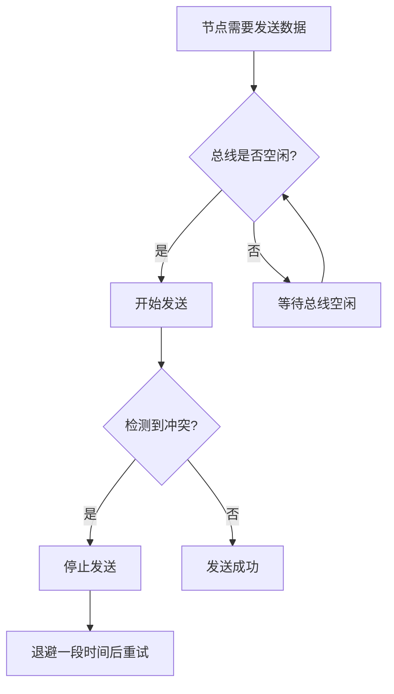
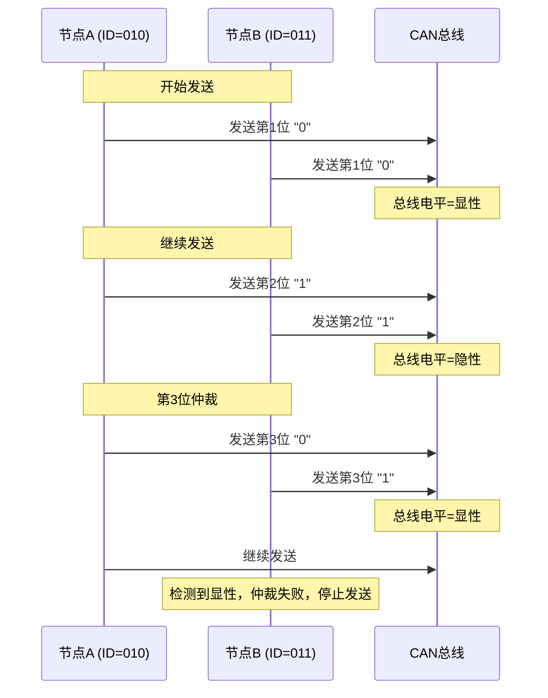
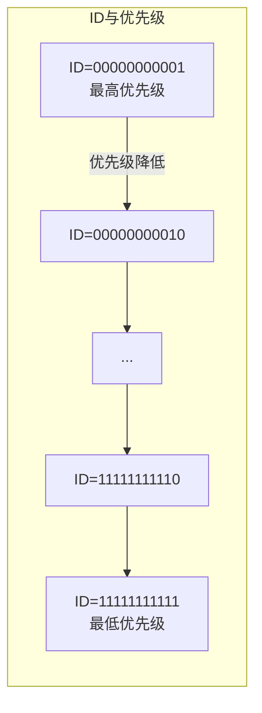

# 总线仲裁与优先级

本章详细介绍 CAN 总线的多主通信机制、仲裁原理以及优先级判定规则。

---

## 3.1 多主通信机制

CAN 总线采用多主通信方式，允许多个节点同时访问总线，而不需要中央仲裁器。这种机制基于 CSMA/CD（载波监听多路访问/冲突检测）原理。

### 3.1.1 CSMA/CD 基本原理



**CAN 的改进**：CAN 在此基础上增加了非破坏性仲裁（CSMA/CA），确保高优先级消息不会因冲突而重发。

### 3.1.2 总线电平特性

CAN 总线的关键特性：
- **显性电平（Dominant）**：逻辑"0"，CAN_H = 3.5V，CAN_L = 1.5V
- **隐性电平（Recessive）**：逻辑"1"，CAN_H = CAN_L = 2.5V
- **显性覆盖隐性**：当有节点发送显性电平时，总线电平被强制拉低

---

## 3.2 非破坏性仲裁

CAN 总线采用**非破坏性仲裁**（Non-Destructive Arbitration），确保高优先级消息优先发送，且发送高优先级的节点不会因仲裁而丢失发送权。

### 3.2.1 仲裁过程



### 3.2.2 仲裁规则

| 规则 | 说明 |
|------|------|
| 位级别仲裁 | 每一位发送时，所有节点都监视总线电平 |
| 隐性失利于显性 | 发送隐性电平但检测到显性电平的节点失去仲裁权 |
| ID 越小优先级越高 | 二进制值越小，优先级越高 |
| RTR 位参与仲裁 | RTR=0（数据帧）优先于 RTR=1（远程帧） |

### 3.2.3 仲裁获胜条件

**仲裁获胜的节点必须满足**：
1. 发送的所有位都与总线监视的电平一致
2. 在仲裁场结束后继续成功发送

**仲裁失败的节点**：
1. 检测到发送的位与总线电平不一致
2. 立即转为接收模式
3. 在总线空闲时重试发送

---

## 3.3 优先级与 ID

### 3.3.1 ID 与优先级的映射



**规律**：二进制值越小，优先级越高

| ID (二进制) | ID (十进制) | 优先级 |
|-------------|-------------|--------|
| 00000000001 | 1 | 最高 |
| 00000000010 | 2 | 次高 |
| ... | ... | ... |
| 11111111111 | 2047 | 最低 |

### 3.3.2 扩展帧优先级

扩展帧的优先级判断规则：
1. 先比较高 11 位 ID（Base ID）
2. Base ID 相同的情况下，SRR 位（隐性）优先级低于 RTR 位（显性）
3. 然后比较低 18 位 ID（Extended ID）

---

## 3.4 位填充规则

### 3.4.1 填充规则

CAN 协议规定：每当发送连续相同电平的位达到 5 位时，必须插入一个相反电平的位。

**需要位填充的字段**：
- 帧起始位（SOF）
- 仲裁场（ID + RTR）
- 控制场（IDE + r0 + DLC）
- 数据场

**不需要位填充的字段**：
- CRC 场（固定分隔符除外）
- ACK 场
- EOF（帧结束）
- 错误分隔符
- 过载分隔符

### 3.4.2 位填充示例

```
原始数据：  11111 0 111110 0 00001
填充后：   111110 111110 0 00001
           └──5─┘ └──5─┘
```

---

## 3.5 总线负载与延迟

### 3.5.1 总线负载率

总线负载率 = 实际传输时间 / 总周期时间

- **推荐负载率**：≤ 30%（保证实时性）
- **最大负载率**：≤ 70%（仍可工作，但延迟增加）

### 3.5.2 消息延迟

消息延迟 = 仲裁时间 + 传输时间 + 传播延迟

| 影响因素 | 说明 |
|----------|------|
| ID 优先级 | 高优先级消息延迟小 |
| 消息长度 | 数据场越长，传输时间越长 |
| 总线负载 | 负载越高，等待时间越长 |
| 节点数量 | 节点越多，冲突概率越高 |

---

## 面试题

### Q1: 什么是 CAN 总线的非破坏性仲裁？

**参考答案**：
非破坏性仲裁是指在仲裁过程中，高优先级的消息不会被低优先级消息影响或破坏。具体过程：
1. 所有节点在发送时同时监视总线电平
2. 发送隐性电平但检测到显性电平的节点立即停止发送
3. 发送显性电平的节点继续发送，不受影响
4. 仲裁失败的节点等待总线空闲后重试

这种机制确保了高优先级消息一定能够成功发送，且不会因为仲裁而丢失数据。

### Q2: 两个相同 ID 的节点同时发送数据帧和远程帧，会发生什么？

**参考答案**：
假设两个节点分别发送：
- 节点A：数据帧（RTR = 0）
- 节点B：远程帧（RTR = 1）

仲裁过程：
1. 前 11 位 ID 相同
2. 第 12 位：节点A 发送显性（0），节点B 发送隐性（1）
3. 总线电平为显性（0）
4. 节点B 检测到显性电平，仲裁失败，停止发送
5. 节点A 赢得仲裁，成功发送数据帧

**结论**：相同 ID 的数据帧优先级高于远程帧。

### Q3: 如何通过设计 ID 来保证关键消息的实时性？

**参考答案**：
1. **分配高优先级 ID**：将关键消息（如安全气囊、刹车系统）分配最低的 ID
2. **分层设计**：将 CAN 总线分段，关键节点使用独立总线
3. **消息长度控制**：关键消息使用较短的数据场，减少传输时间
4. **避免ID冲突**：确保关键消息的 ID 不与其他消息冲突

### Q4: 位填充的作用是什么？

**参考答案**：
位填充主要有以下作用：
1. **提供同步边沿**：确保接收节点能够通过边沿进行位同步
2. **防止帧标志混淆**：避免数据中出现与帧起始/结束标志相同的位模式
3. **错误检测**：接收节点可以通过检测位填充规则来发现错误
