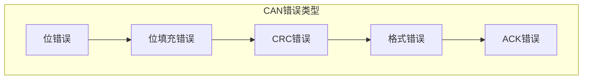
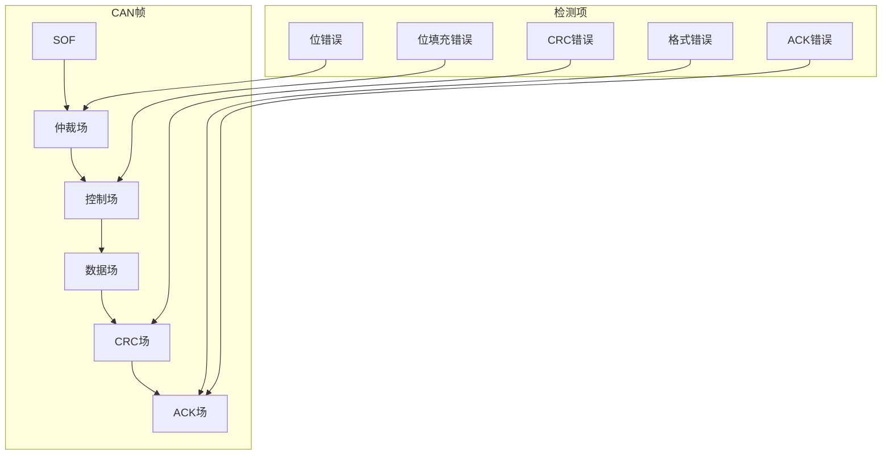
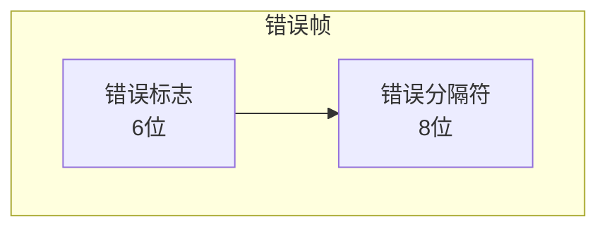
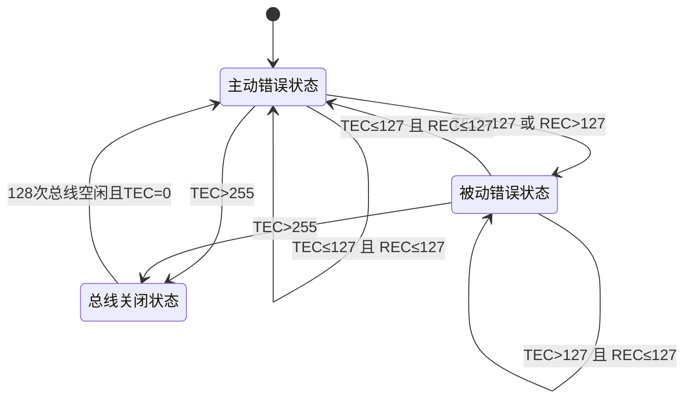
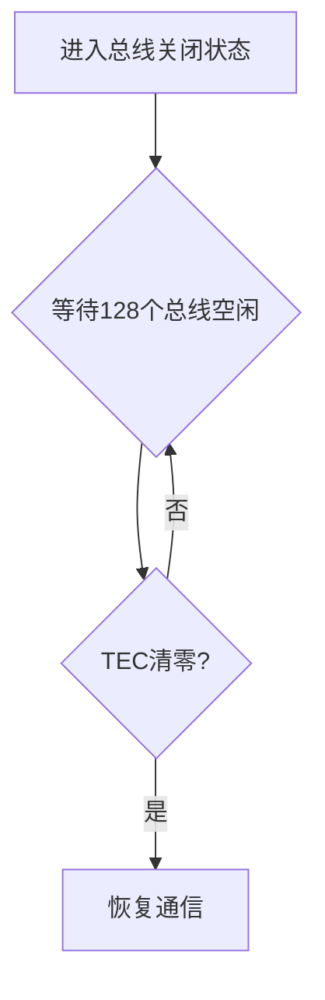

# CAN 错误处理机制

本章详细介绍 CAN 协议的错误检测机制、错误类型、错误状态机以及错误处理策略。

---

## 4.1 错误检测机制

CAN 协议具有完善的错误检测机制，能够检测多种类型的错误，确保通信的可靠性。

### 4.1.1 五种错误类型

| 错误类型 | 检测位置 | 说明 |
|----------|----------|------|
| 位错误 | 所有位 | 发送的位与监视的位不一致 |
| 位填充错误 | 需要填充的字段 | 违反位填充规则 |
| CRC 错误 | CRC 场 | 接收的 CRC 与计算的不一致 |
| 格式错误 | 固定格式字段 | 帧格式不符合规范 |
| ACK 错误 | ACK 槽 | 发送节点未收到有效 ACK |

### 4.1.2 错误检测位置

---

## 4.2 错误帧

### 4.2.1 错误帧结构

**错误标志**：
- **主动错误标志**：6 位显性电平（处于主动错误状态的节点发送）
- **被动错误标志**：6 位隐性电平（处于被动错误状态的节点发送）

**错误分隔符**：8 位隐性电平

### 4.2.2 错误帧发送时机

当节点检测到错误时，会立即发送错误帧，包括：
1. 位错误
2. 位填充错误
3. CRC 错误
4. 格式错误
5. ACK 错误

---

## 4.3 错误计数器

CAN 协议使用两个计数器来跟踪错误发生情况：

### 4.3.1 计数器类型

| 计数器 | 名称 | 用途 |
|--------|------|------|
| TEC | 发送错误计数器 | 记录发送错误 |
| REC | 接收错误计数器 | 记录接收错误 |

### 4.3.2 计数器规则

**TEC 增加条件**：
| 条件 | 增加量 |
|------|--------|
| 发送节点检测到位错误 | +8 |
| 发送节点检测到 ACK 错误 | +8 |
| 发送错误帧（主动） | +8 |
| 发送错误帧（被动） | +4 |

**TEC 减少条件**：
| 条件 | 减少量 |
|------|--------|
| 成功发送一帧 | -1（大于0时） |

**REC 增加条件**：
| 条件 | 增加量 |
|------|--------|
| 接收节点检测到位错误 | +1 |
| 接收节点检测到位填充错误 | +1 |
| 接收节点检测到 CRC 错误 | +1 |
| 接收错误帧（主动） | +8 |
| 接收错误帧（被动） | +4 |

**REC 减少条件**：
| 条件 | 减少量 |
|------|--------|
| 成功接收一帧 | -1（大于0时） |

---

## 4.4 错误状态机

CAN 节点有三种错误状态，根据错误计数器的值自动转换。

### 4.4.1 三种错误状态

| 状态 | 条件 | 行为 |
|------|------|------|
| **主动错误状态** | TEC≤127 且 REC≤127 | 正常通信，检测到错误时发送主动错误标志 |
| **被动错误状态** | TEC>127 或 REC>127 | 可以通信但受限制，检测到错误时发送被动错误标志 |
| **总线关闭状态** | TEC>255 | 完全停止通信，需要软件干预恢复 |

### 4.4.2 状态特性对比

| 特性 | 主动错误状态 | 被动错误状态 | 总线关闭状态 |
|------|--------------|--------------|--------------|
| 发送能力 | 正常 | 受限（需等待） | 无 |
| 接收能力 | 正常 | 正常 | 无 |
| 错误标志 | 主动（6位显性） | 被动（6位隐性） | 无 |
| 总线影响 | 正常 | 较小 | 无 |

---

## 4.5 总线关闭与恢复

### 4.5.1 总线关闭条件

当 TEC > 255 时，节点进入总线关闭状态（Bus Off），停止所有 CAN 通信。

### 4.5.2 总线关闭恢复

**恢复方式**：
1. **自动恢复**：部分 CAN 控制器支持，等待 128 个总线空闲后自动恢复
2. **手动恢复**：需要软件清除错误状态，重新初始化 CAN 控制器

---

## 面试题

### Q1: CAN 错误帧的作用是什么？

**参考答案**：
错误帧的作用是通知总线上所有节点发生了错误。具体：
1. 当节点检测到错误时，立即在总线上发送错误帧
2. 其他节点接收到错误帧后，会丢弃当前正在接收的帧
3. 发送节点会尝试重新发送数据
4. 错误帧确保了错误不会在网络中传播

### Q2: 主动错误状态和被动错误状态有什么区别？

**参考答案**：

| 区别 | 主动错误状态 | 被动错误状态 |
|------|--------------|--------------|
| 触发条件 | TEC≤127 且 REC≤127 | TEC>127 或 REC>127 |
| 错误标志 | 6位显性电平 | 6位隐性电平 |
| 总线影响 | 强制拉低总线 | 无法强制拉低 |
| 发送延迟 | 无延迟 | 需等待总线空闲后发送 |

被动错误状态节点的发送会被延迟，因为它只能发送隐性电平，无法与其他节点争夺总线。

### Q3: 节点进入总线关闭状态后如何恢复？

**参考答案**：
两种恢复方式：
1. **自动恢复**：等待 128 个连续的隐性电平（总线空闲），且 TEC 值自动清零后恢复
2. **手动恢复**：
   - 软件检测到总线关闭状态
   - 清除错误状态寄存器
   - 重新初始化 CAN 控制器
   - 重新配置过滤器等

### Q4: CAN 错误计数器为什么会设置两个不同的阈值（127 和 255）？

**参考答案**：
1. **127（警告阈值）**：提醒开发者 CAN 总线错误较多，需要关注
2. **255（关闭阈值）**：节点完全与总线隔离，防止故障节点影响整个网络

这种设计实现了错误处理的渐进式策略：先警告，再隔离，给系统和开发者提供处理机会。

### Q5: 如何诊断 CAN 总线通信故障？

**参考答案**：
1. **查看错误计数器**：TEC 和 REC 的值可以反映错误来源
2. **检查错误状态**：主动错误/被动错误/总线关闭
3. **分析错误帧**：捕获错误帧分析错误类型
4. **检查物理层**：终端电阻、CAN_H/CAN_L 电压
5. **使用 CAN 分析仪**：抓取总线数据，分析错误原因
