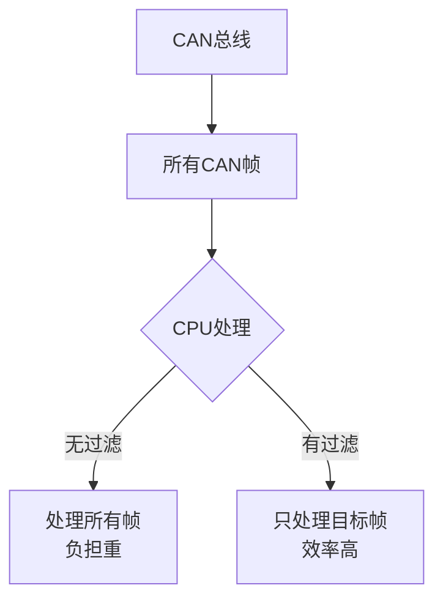
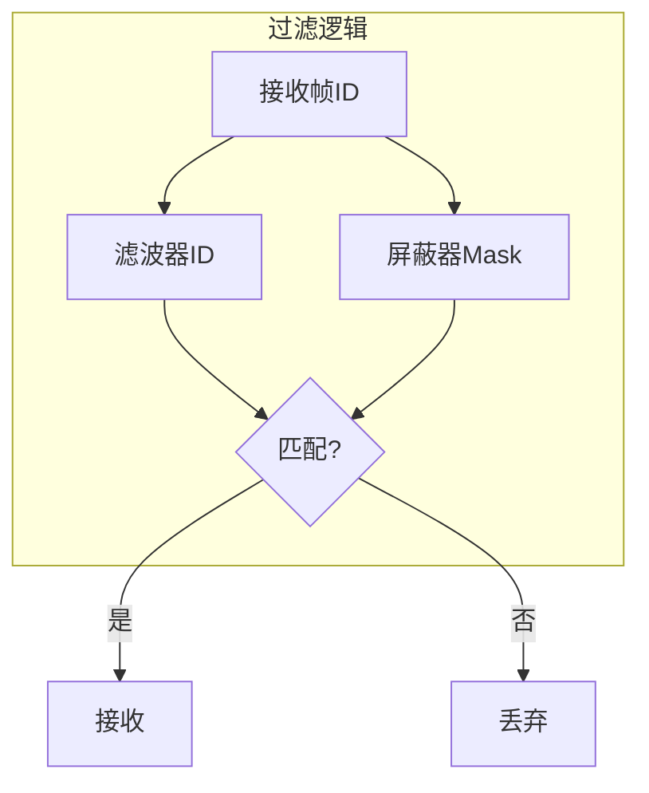
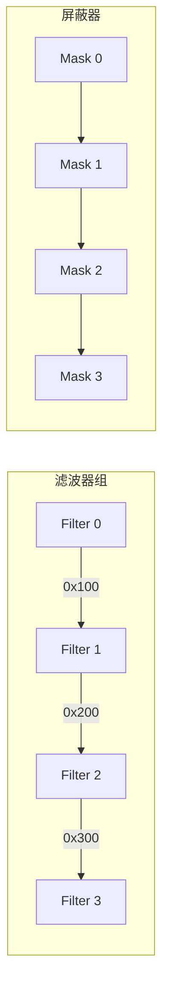

# 滤波器与屏蔽器

本章详细介绍 CAN 控制器的滤波器（Filter）和屏蔽器（Mask）的工作原理、配置方法及典型应用场景。

---

## 5.1 滤波器概述

CAN 滤波器的作用是根据预设的规则过滤接收到的 CAN 帧，只接收符合条件的数据帧或远程帧，减轻 CPU 的处理负担。

### 5.1.1 为什么需要滤波器



**无滤波器的缺点**：
- CPU 需要处理所有接收到的 CAN 帧
- 浪费 CPU 资源
- 增加中断频率
- 难以实现多路复用通信

---

## 5.2 滤波器工作原理

### 5.2.1 滤波器与屏蔽器



**关键概念**：
- **滤波器（Filter）**：要匹配的 ID 值
- **屏蔽器（Mask）**：决定哪些位需要比较

### 5.2.2 过滤公式

```
(接收ID AND Mask) == (Filter AND Mask)
```

**解释**：
- 屏蔽器位 = 1：该位置需要匹配
- 屏蔽器位 = 0：该位置忽略

---

## 5.3 滤波器配置模式

### 5.3.1 精确匹配模式

只接收与滤波器 ID 完全一致的帧。

```
Mask = 0x7FF  (所有位都参与比较)
Filter = 0x123
接收ID = 0x123  →  接收
接收ID = 0x124  →  丢弃
```

### 5.3.2 范围匹配模式

接收某一范围内的 ID。

```
假设：
Mask = 0x700
Filter = 0x200

ID 0x201 → (0x201 & 0x700) = 0x200 = (0x200 & 0x700) → 接收
ID 0x2FF → (0x2FF & 0x700) = 0x200 = (0x200 & 0x700) → 接收
ID 0x301 → (0x301 & 0x700) = 0x300 ≠ 0x200 → 丢弃
```

### 5.3.3 列表模式

接收多个指定 ID。

```
配置：
Filter0 = 0x100
Filter1 = 0x200
Filter2 = 0x300
Mask = 0x7FF (精确匹配)

接收：0x100, 0x200, 0x300
丢弃：其他
```

---

## 5.4 滤波器组配置示例

### 5.4.1 典型配置场景



### 5.4.2 标准帧过滤器配置

**示例 1：精确匹配单个 ID**

```c
// 只想接收 ID = 0x123 的帧
CAN_FilterConf.FilterId = 0x123 << 5;  // 左移5位，因为低5位是其他控制位
CAN_FilterConf.FilterMaskId = 0x7FF << 5;  // 所有位都精确匹配
```

**示例 2：匹配多个连续 ID**

```c
// 只想接收 ID 范围 0x100-0x1FF
CAN_FilterConf.FilterId = 0x100 << 5;
CAN_FilterConf.FilterMaskId = 0x700 << 5;  // 高3位不关心
```

### 5.4.3 扩展帧过滤器配置

```c
// 扩展帧过滤
CAN_FilterConf.FilterId = 0x12345678 << 3;
CAN_FilterConf.FilterMaskId = 0x1FFFFFFF << 3;
```

---

## 5.5 过滤器位定义

### 5.5.1 标准帧过滤器结构

| 位位置 | 位含义 |
|--------|--------|
| [31:21] | 标准 ID (11位) |
| [20] | IDE (标识符扩展位) |
| [19] | RTR (远程传输请求位) |
| [18:15] | 保留 |
| [14:5] | 滤波器 ID |
| [4:0] | 控制位 |

### 5.5.2 扩展帧过滤器结构

| 位位置 | 位含义 |
|--------|--------|
| [31:3] | 扩展 ID (29位) |
| [2] | IDE |
| [1] | RTR |
| [0] | 保留 |

---

## 5.6 典型应用场景

### 5.6.1 场景一：车载诊断

```c
// 只接收诊断请求 (ID = 0x7E8)
Filter.FilterId = 0x7E8 << 5;
Filter.FilterMaskId = 0x7FF << 5;
```

### 5.6.2 场景二：多路 CAN 数据

```c
// 滤波器0: 接收 ID 0x100-0x1FF (发动机数据)
Filter0.FilterId = 0x100 << 5;
Filter0.FilterMaskId = 0x700 << 5;

// 滤波器1: 接收 ID 0x200-0x2FF (车速数据)
Filter1.FilterId = 0x200 << 5;
Filter1.FilterMaskId = 0x700 << 5;

// 滤波器2: 接收 ID 0x300-0x3FF (车身数据)
Filter2.FilterId = 0x300 << 5;
Filter2.FilterMaskId = 0x700 << 5;
```

### 5.6.3 场景三：接收所有广播消息

```c
// 接收所有标准帧 (忽略扩展帧)
Filter.FilterId = 0 << 5;
Filter.FilterMaskId = (0x7FF << 5) | (1 << 1);  // 掩码 IDE 位
```

---

## 面试题

### Q1: CAN 滤波器中 Filter 和 Mask 的区别是什么？

**参考答案**：
- **Filter（滤波器）**：要匹配的 ID 值，指定期望接收的 ID
- **Mask（屏蔽器）**：掩码位，决定 Filter 中哪些位需要比较

工作原理：
- Mask 位 = 1：该位置必须与 Filter 匹配
- Mask 位 = 0：该位置忽略，不参与匹配

例如：
```
Filter = 0x123
Mask = 0xFF0

接收ID = 0x120 → (0x120 & 0xFF0) = 0x120 ≠ 0x120? 不对，应该是(0x123 & 0xFF0) = 0x120，匹配 → 接收
接收ID = 0x12F → (0x12F & 0xFF0) = 0x120 = 0x120 → 接收
接收ID = 0x001 → (0x001 & 0xFF0) = 0x000 ≠ 0x120 → 丢弃
```

### Q2: 如何配置过滤器只接收特定范围的 ID？

**参考答案**：
通过设置 Mask 值为特定模式，例如：

接收 0x100-0x1FF：
```
Filter = 0x100 << 5
Mask = 0x700 << 5  // 高3位为0，表示忽略
```

这样只有高3位为 001 的 ID 才会匹配，即 0x100-0x1FF。

### Q3: 如果有多个过滤器，如何配置？

**参考答案**：
1. **独立模式**：每个过滤器独立工作，任何一个匹配就接收
2. **组合模式**：多个过滤器组合使用

大多数 CAN 控制器支持多个过滤器组，每个过滤器组可以独立配置。配置时需要：
1. 启用对应编号的过滤器
2. 设置 Filter ID 和 Mask
3. 选择过滤器模式（精确/范围）

### Q4: CAN 过滤器可以过滤 RTR 位吗？

**参考答案**：
可以。RTR 位（远程请求位）决定了帧是数据帧还是远程帧。过滤器配置中可以包含 RTR 位：

```
Filter = (ID << 5) | (0 << 1)  // 只匹配数据帧 (RTR=0)
Mask = (0x7FF << 5) | (1 << 1)  // RTR 位需要匹配
```

这样可以只接收特定 ID 的数据帧，不接收远程帧。

### Q5: 过滤器配置错误会导致什么问题？

**参考答案**：
1. **漏接消息**：过滤条件太严格，错过需要接收的帧
2. **接收垃圾帧**：过滤条件太宽松，收到不需要的帧，增加 CPU 负担
3. **无法接收任何帧**：Mask 或 Filter 配置错误，导致所有帧都被过滤
4. **扩展帧/标准帧混淆**：IDE 位配置错误，导致无法正确识别帧类型
