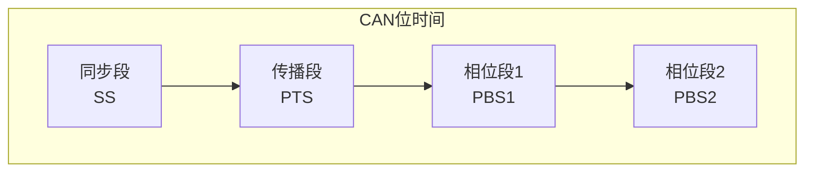
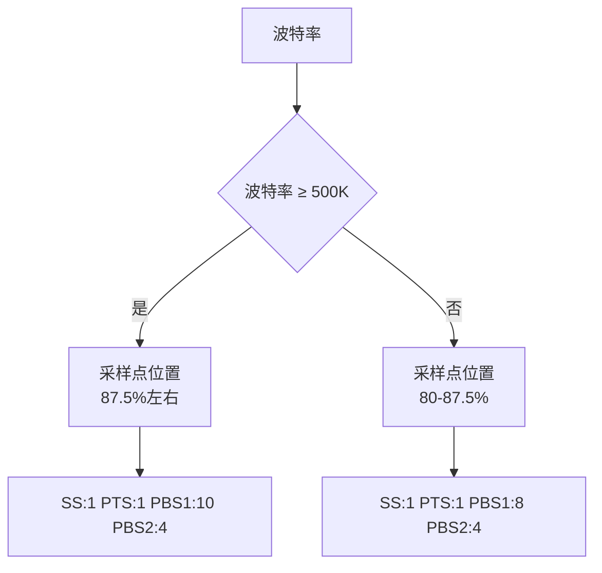
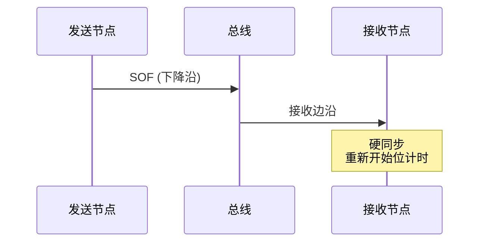
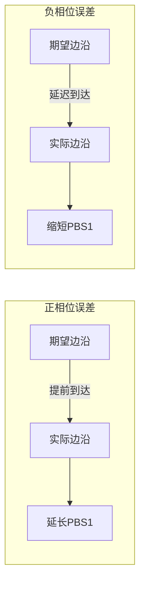
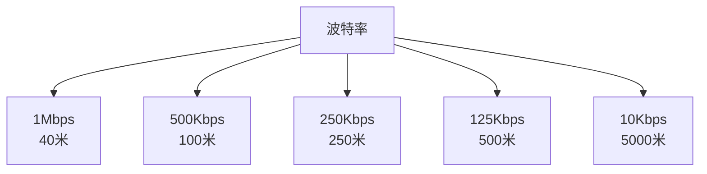

# 位时序与波特率

本章详细介绍 CAN 协议的位时序结构、波特率配置方法以及同步机制。

---

## 6.1 位时序结构

CAN 协议的每一位由四个时间段组成，这种设计确保了各节点之间的同步和仲裁的可靠性。

### 6.1.1 位时间分段



| 段名称 | 缩写 | 说明 |
|--------|------|------|
| 同步段 | SS | 同步所有节点 |
| 传播段 | PTS | 补偿物理延迟 |
| 相位段1 | PBS1 | 补偿相位误差 |
| 相位段2 | PBS2 | 补偿相位误差 |
| 采样点 | - | PBS1 结束的位置 |

### 6.1.2 各段功能

**同步段（Sync Segment）**
- 长度：1 个时间量子（Time Quantum，TQ）
- 作用：硬同步的参考点，所有节点在此同步

**传播段（Prop Segment）**
- 长度：1-8 个 TQ
- 作用：补偿信号在总线上的传播延迟
- 计算：2 × (节点间最大距离 / 信号速度)

**相位段1（Phase Segment 1）**
- 长度：1-8 个 TQ
- 作用：补偿正相位误差
- 可通过重同步调整长度

**相位段2（Phase Segment 2）**
- 长度：2-8 个 TQ
- 作用：补偿负相位误差
- 采样点在此段结束前

---

## 6.2 时间量子（Time Quantum）

### 6.2.1 TQ 计算

```
TQ = (BRP + 1) / fAPB
```

其中：
- **BRP**（Baud Rate Prescaler）：波特率预分频器，1-1024
- **fAPB**：APB 时钟频率

### 6.2.2 位时间计算

```
位时间 = (SS + PTS + PBS1 + PBS2) × TQ
```

---

## 6.3 波特率配置

### 6.3.1 标准波特率

| 波特率 | 典型应用 | 最大总线长度 |
|--------|----------|--------------|
| 1 Mbps | 高速 CAN | 40 米 |
| 500 Kbps | 汽车高速 | 100 米 |
| 250 Kbps | 汽车中速 | 250 米 |
| 125 Kbps | 汽车低速 | 500 米 |
| 10 Kbps | 诊断/低速 | 5000 米 |

### 6.3.2 配置示例

假设系统时钟为 36MHz，要配置 500Kbps 波特率：

```c
// 计算 TQ 数量
// 设每个位需要 18 TQ
// 500Kbps = 500000 位/秒
// TQ = 1 / (500000 × 18) = 1 / 9000000 = 111.11 ns

// BRP 配置
BRP = 36MHz / (18 × 500KHz) - 1 = 3

// 各段配置
SS = 1 TQ
PTS = 2 TQ
PBS1 = 10 TQ
PBS2 = 5 TQ
// 总计 18 TQ
```

### 6.3.3 配置参数建议



| 波特率 | 推荐采样点 | SS:PTS:PBS1:PBS2 |
|--------|------------|------------------|
| 1 Mbps | 87.5% | 1:1:10:4 |
| 500 Kbps | 87.5% | 1:2:10:4 |
| 250 Kbps | 85% | 1:2:8:4 |
| 125 Kbps | 85% | 1:2:8:4 |

---

## 6.4 同步机制

### 6.4.1 同步类型

CAN 协议支持两种同步机制：

| 同步类型 | 说明 |
|----------|------|
| 硬同步 | 帧起始时（SOF）强制同步 |
| 重同步 | 位传输过程中调整 PBS1 长度 |

### 6.4.2 硬同步

- **触发条件**：检测到 SOF（帧起始位）
- **效果**：所有节点将 SS 段边界与 SOF 边沿对齐
- **发生时机**：每个帧开始时



### 6.4.3 重同步

- **触发条件**：边沿在 SS 段之外检测到
- **效果**：调整 PBS1 长度来补偿时钟误差
- **分类**：
  - **正相位误差**：边沿来得太早 → 增加 PBS1
  - **负相位误差**：边沿来得太晚 → 减少 PBS1



---

## 6.5 同步跳转宽度（SJW）

### 6.5.1 定义

SJW（Synchronization Jump Width）定义了重同步时 PBS1 最大调整量。

### 6.5.2 配置规则

```
SJW ≤ min(PBS1, PBS2)
SJW 范围：1-4 TQ
```

### 6.5.3 配置示例

```c
// 典型配置
CAN_InitStructure.CAN_SJW = CAN_SJW_1TQ;  // 1-4 TQ
CAN_InitStructure.CAN_BS1 = CAN_BS1_10TQ; // PBS1: 1-16 TQ
CAN_InitStructure.CAN_BS2 = CAN_BS2_5TQ;  // PBS2: 1-8 TQ
CAN_InitStructure.CAN_Prescaler = 4;       // BRP: 1-1024
```

---

## 6.6 位时间与总线长度

### 6.6.1 延迟计算

总延迟 = 发送延迟 + 传播延迟 + 接收延迟

```
总延迟 = 2 × (t_bus + t_node)
```

其中：
- t_bus：信号在总线上的传播时间
- t_node：节点内部处理延迟

### 6.6.2 最大总线长度



---

## 面试题

### Q1: CAN 位时间中各个段的作用是什么？

**参考答案**：
1. **同步段（SS）**：提供同步参考点，用于硬同步
2. **传播段（PTS）**：补偿信号在总线和节点中的物理传播延迟
3. **相位段1（PBS1）**：补偿正相位误差，可通过重同步调整
4. **相位段2（PBS2）**：补偿负相位误差，采样点在此段结束前

### Q2: 如何计算 CAN 波特率？

**参考答案**：
波特率计算公式：

```
波特率 = fAPB / [(BRP + 1) × (1 + PTS + PBS1 + PBS2)]
```

其中：
- fAPB：CAN 时钟频率
- BRP：波特率预分频器（1-1024）
- PTS + PBS1 + PBS2：各段时间的 TQ 总数

例如：fAPB = 36MHz，BRP=3，PTS=2，PBS1=10，PBS2=5
```
波特率 = 36MHz / [4 × 18] = 36MHz / 72 = 500Kbps
```

### Q3: 采样点应该在什么时候？为什么？

**参考答案**：
采样点通常设置在位时间的 75%-87.5% 处，常见为 87.5%。

原因：
1. **避开边沿**：确保在信号稳定后采样
2. **优化仲裁**：采样点靠后可以给仲裁更多时间
3. **抗干扰**：避开信号边沿附近的噪声

### Q4: 重同步的作用是什么？如何调整？

**参考答案**：
**作用**：补偿各节点之间的时钟误差，确保采样点准确

**调整方式**：
- **正相位误差**：边沿比预期早到 → 延长 PBS1
- **负相位误差**：边沿比预期晚到 → 缩短 PBS1

调整量受 SJW 限制，最大调整幅度为 SJW 个 TQ。

### Q5: 为什么高速 CAN 和低速 CAN 的最大总线长度不同？

**参考答案**：
1. **信号延迟**：高速 CAN（1Mbps）每比特时间短，需要更短的传播延迟
2. **终端电阻**：高速 CAN 使用 120Ω 终端电阻，低速 CAN 使用不同配置
3. **容错设计**：低速 CAN 容错能力更强，支持更长距离

计算公式：
```
最大长度 = (PTS + PBS1) × TQ × 信号速度 / 2
```

高速 CAN 的 PTS + PBS1 时间更短，因此最大长度更短。
