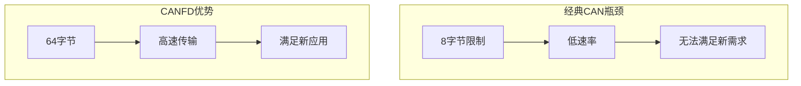
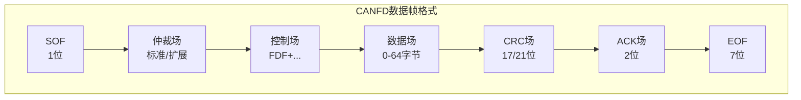
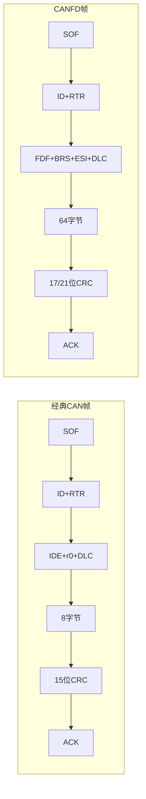
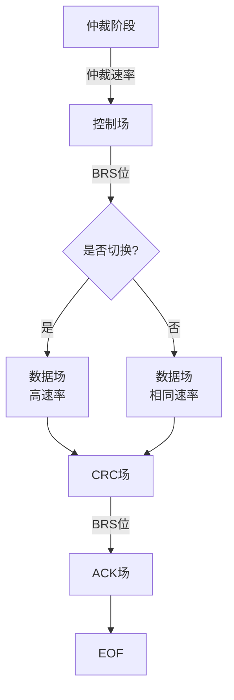
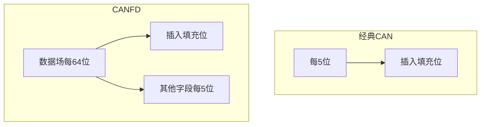
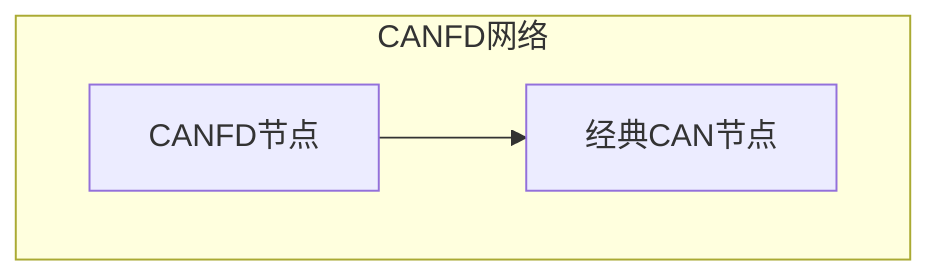
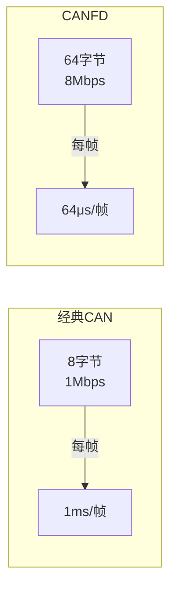

# CANFD 协议

本章详细介绍 CANFD（CAN with Flexible Data Rate）协议，包括与经典 CAN 的区别、新特性以及应用场景。

---

## 7.1 CANFD 概述

CANFD 是 Bosch 在 2012 年推出的改进协议，在保留 CAN 协议核心特性的同时，提高了数据传输速率和有效载荷。

### 7.1.1 CANFD 主要改进

| 特性 | 经典 CAN | CANFD |
|------|----------|-------|
| 数据速率 | 最高 1 Mbps | 最高 8 Mbps |
| 数据长度 | 最多 8 字节 | 最多 64 字节 |
| 帧格式 | 兼容 | 向前兼容 |
| 错误检测 | 15 位 CRC | 17/21 位 CRC |
| 仲裁 | 相同 | 相同 |

### 7.1.2 为什么需要 CANFD



**经典 CAN 的局限性**：
1. 数据场最大 8 字节，无法传输大数据量
2. 最高 1 Mbps 速率不足
3. 大数据量传输效率低

---

## 7.2 CANFD 帧结构

### 7.2.1 CANFD 数据帧



### 7.2.2 新增控制位

| 位 | 名称 | 说明 |
|----|------|------|
| FDF | Flexible Data Rate Format | 1 = CANFD 帧 |
| BRS | Bit Rate Switch | 1 = 切换到高速率 |
| ESI | Error State Indicator | 发送节点错误状态 |

### 7.2.3 经典 CAN 与 CANFD 对比



---

## 7.3 双速率机制

### 7.3.1 速率切换

CANFD 的一大特色是在一个帧内切换速率：



### 7.3.2 典型配置

| 阶段 | 速率 |
|------|------|
| 仲裁场 | 500 Kbps 或 1 Mbps |
| 控制场 | 同上 |
| 数据场 | 2-8 Mbps |

### 7.3.3 BRS 位

- **BRS = 0**：数据场使用与仲裁场相同的速率
- **BRS = 1**：数据场切换到更高速率

---

## 7.4 改进的 CRC

### 7.4.1 CRC 多项式

| 数据长度 | CRC 位数 | 多项式 |
|----------|----------|--------|
| ≤ 16 字节 | 17 位 | CRC_17 |
| > 16 字节 | 21 位 | CRC_21 |

### 7.4.2 填充位计算变化



---

## 7.5 CANFD 与经典 CAN 兼容性

### 7.5.1 混合网络

CANFD 可以与经典 CAN 共存在同一网络中，但需要特殊处理：



**兼容性考虑**：
1. 经典 CAN 节点无法解析 CANFD 帧
2. 需要使用 CANFD 截获（Silent）模式
3. 网络设计时需考虑节点能力差异

### 7.5.2 解决方案

1. **独立总线**：CANFD 和 CAN 使用不同总线
2. **协议转换**：使用网关转换
3. **兼容模式**：限制 CANFD 特性以兼容经典 CAN

---

## 7.6 CANFD 应用场景

### 7.6.1 典型应用

| 领域 | 应用 | 数据需求 |
|------|------|----------|
| 汽车电子 | OTA 升级 | 10-64 MB |
| 汽车电子 | 诊断数据 | 更大诊断帧 |
| 工业自动化 | 固件更新 | 大文件传输 |
| 轨道交通 | 视频传输 | 高速大数据 |

### 7.6.2 带宽需求对比



---

## 7.7 CANFD 配置示例

### 7.7.1 控制器配置

```c
// CANFD 配置示例
CANFD_InitTypeDef CANFD_InitStruct;

// 仲裁段速率
CANFD_InitStruct.BaudRateFD = 500000;     // 仲裁段速率 500Kbps
CANFD_InitStruct.uword = 18;             // 仲裁段 TQ 数

// 数据段速率
CANFD_InitStruct.DataBrps = 2000000;     // 数据段速率 2Mbps
CANFD_InitStruct.dword = 18;             // 数据段 TQ 数

// 数据长度
CANFD_InitStruct.DataLen = 64;           // 最大 64 字节
```

### 7.7.2 典型参数

| 参数 | 仲裁段 | 数据段 |
|------|--------|--------|
| 波特率 | 500 Kbps / 1 Mbps | 2-8 Mbps |
| 位时间 | 16-20 TQ | 16-20 TQ |
| 采样点 | 87.5% | 87.5% |

---

## 7.8 CANXL 简介

### 7.8.1 最新发展

CANXL（CAN Extended Length）是 CANFD 的下一代标准，2023 年发布：

| 特性 | CANFD | CANXL |
|------|-------|-------|
| 最大速率 | 8 Mbps | 10+ Mbps |
| 最大数据长度 | 64 字节 | 2048 字节 |
| 兼容性 | 部分兼容 | 向后兼容 |

### 7.8.2 CANXL 新特性

1. **更长数据场**：支持高达 2048 字节
2. **更高速率**：支持 10 Mbps 以上
3. **增强错误检测**：更强的 CRC
4. **标准化**：ISO 11898-2:2023

---

## 面试题

### Q1: CANFD 与经典 CAN 的主要区别是什么？

**参考答案**：
1. **数据传输速率**：经典 CAN 最高 1 Mbps，CANFD 最高 8 Mbps
2. **数据场长度**：经典 CAN 最多 8 字节，CANFD 最多 64 字节
3. **帧格式**：CANFD 新增 FDF、BRS、ESI 控制位
4. **CRC**：经典 CAN 使用 15 位 CRC，CANFD 使用 17/21 位 CRC
5. **兼容性**：CANFD 向前兼容经典 CAN

### Q2: CANFD 的速率切换是如何实现的？

**参考答案**：
CANFD 在一帧内实现双速率：
1. 仲裁场和控制场使用较低速率（通常 500Kbps-1Mbps）
2. 数据场通过 BRS 位切换到高速率（2-8Mbps）
3. CRC 场和 ACK 场可以继续使用高速率

这种设计确保：
- 仲裁过程稳定可靠
- 数据传输快速高效
- 与经典 CAN 兼容

### Q3: CANFD 如何保证与经典 CAN 的兼容性？

**参考答案**：
1. **FDF 位**：CANFD 帧通过 FDF 位与经典 CAN 区分
2. **经典 CAN 节点处理**：遇到 FDF=1 的帧会报格式错误
3. **混合网络**：需要使用 CANFD 截获模式让经典节点通过
4. **配置兼容模式**：限制 CANFD 特性，使用与经典 CAN 相同的速率

### Q4: 为什么 CANFD 需要更长的 CRC？

**参考答案**：
CANFD 的数据场从 8 字节增加到 64 字节，原有的 15 位 CRC 无法提供足够的安全余量：

| 数据长度 | 原 CRC 误判率 | 新 CRC 误判率 |
|----------|---------------|---------------|
| 8 字节 | 2^-15 | - |
| 64 字节 | - | 2^-21 |

更长的 CRC 提高了错误检测能力，确保大数据量传输的可靠性。

### Q5: 什么情况下选择 CANFD 而不是经典 CAN？

**参考答案**：
1. **大数据量传输**：需要传输超过 8 字节的数据
2. **高速要求**：需要超过 1 Mbps 的传输速率
3. **固件更新**：需要快速传输大文件
4. **未来升级**：产品需要支持更高速率和更大数据

如果项目只需要传输少量数据（≤8字节）且速率要求不高（≤1Mbps），经典 CAN 仍然是可靠且经济的选择。
