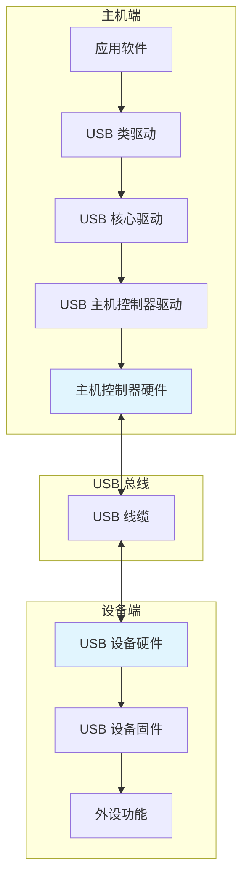
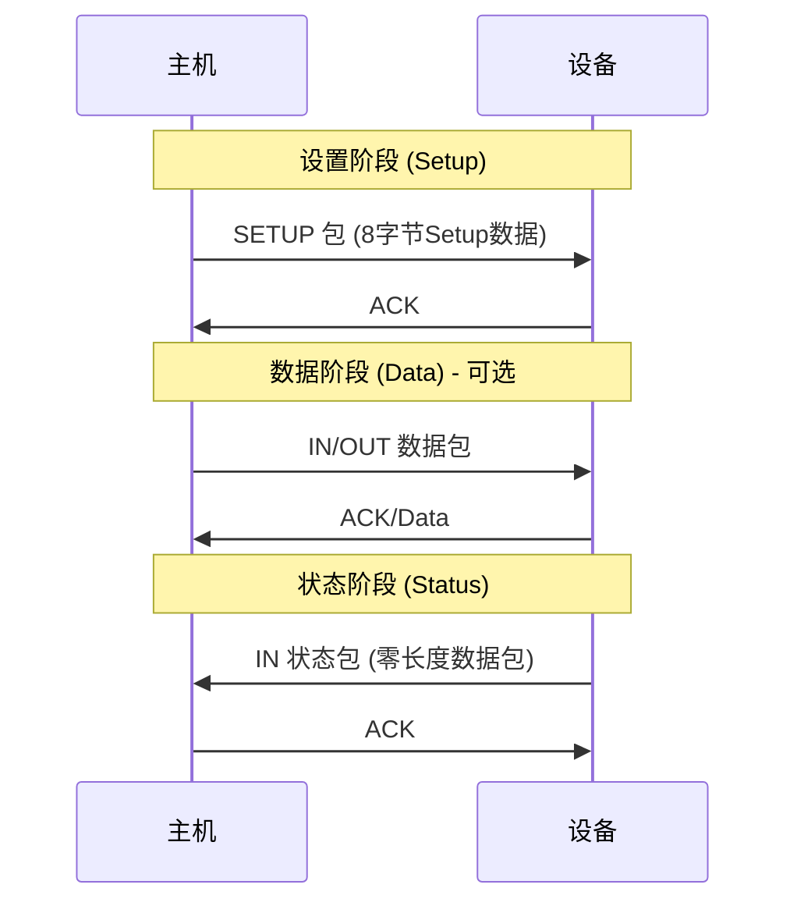
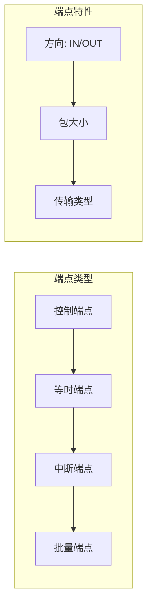
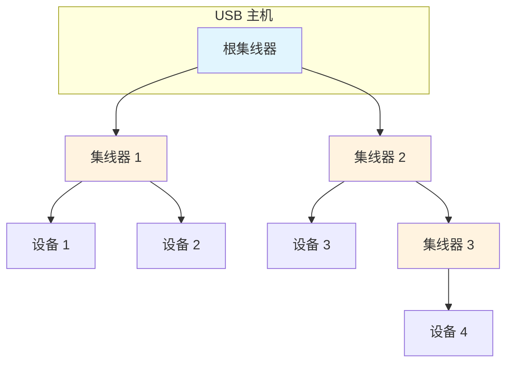

# USB 协议基础

本章介绍 USB 协议的核心概念和基础知识，是理解整个 USB 协议栈的根基。

---

## 1.1 USB 协议分层架构

USB 采用分层的通信架构，从底层到顶层依次为：物理层、协议层（数据链路层）、事务层、传输层、设备层。



**物理层**：定义 USB 的电气特性，包括电压等级（5V/3.3V）、信号编码（NRZI）、阻抗匹配等。D+/D- 为差分数据线，全速/高速模式下为 90Ω 差分阻抗。

**协议层**：负责 USB 数据的组包和解包，包括同步、CRC 校验、数据-toggle 管理等。

**事务层**：USB 最核心的层级，负责组织事务（Setup、IN、OUT），管理数据流和控制流。每个事务包含 Token、Data、Handshake 三个阶段。

**传输层**：基于事务层，提供四种传输类型：控制传输、批量传输、等时传输、中断传输。

---

## 1.2 USB 速率等级

| 速率等级 | 速率 | 标准版本 | 典型应用 |
|----------|------|----------|----------|
| 低速 (Low-Speed) | 1.5 Mbps | USB 1.0 | 键盘、鼠标、HID |
| 全速 (Full-Speed) | 12 Mbps | USB 1.1 | 音频设备、 HID |
| 高速 (High-Speed) | 480 Mbps | USB 2.0 | 存储设备、视频 |
| 超高速 (SuperSpeed) | 5 Gbps | USB 3.0 | 高速存储、显示器 |
| 超高速 Plus (SuperSpeed+) | 10/20 Gbps | USB 3.1/3.2 | 高速数据传输 |

⚠️ **注意**：USB 2.0 兼容 USB 1.1，但 USB 3.x 设备插入 USB 2.0 端口会自动降速。开发时需注意设备与主机的速率协商。

---

## 1.3 四种传输类型

USB 提供了四种传输类型，以满足不同应用场景的需求。

### 1.3.1 控制传输 (Control Transfer)

控制传输用于 USB 枚举和配置，是每个设备必须的传输类型。它分为三个阶段：设置阶段（Setup）、数据阶段（可选）、状态阶段（Status）。



控制传输保证数据准确性，支持错误恢复，但带宽保证有限。控制传输的最大包大小：低速 8 字节，全速 64 字节，高速 64 字节。

### 1.3.2 等时传输 (Isochronous Transfer)

等时传输用于实时数据流，如音频、视频设备。它提供固定带宽，保证传输时效性，但不保证数据准确性（无重传机制）。

等时传输的特点：事务有固定时间槽、无 ACK 握手（仅 IN/OUT 数据包）、数据错误不重传、端点需指定周期性间隔。

⚠️ **注意**：等时传输适用于容忍数据丢失但要求准时送达的场景（如音视频流），不适用于需要可靠传输的数据。

### 1.3.3 中断传输 (Interrupt Transfer)

中断传输用于低频率的数据传输，保证在指定时间间隔内完成，适用于人机交互设备（键盘、鼠标）和事件驱动型设备。

中断传输的特点：主机按轮询间隔（Polling Interval）查询设备、数据量小（通常 ≤ 64/1024 字节）、支持数据校验和重传、端点描述符中指定轮询周期。

轮询间隔范围：高速端点 1-16 微帧（125μs-2ms），全速/低速端点 1-255ms。

### 1.3.4 批量传输 (Bulk Transfer)

批量传输用于大量数据的可靠传输，适用于存储设备、打印机、串口等需要保证数据完整性的场景。

批量传输的特点：仅在全速/高速模式可用、无固定带宽保证（空闲时使用剩余带宽）、支持错误检测和重传、大数据包（高速最大 512 字节）。

⚠️ **注意**：批量传输没有固定的时间保证，当总线繁忙时可能等待。设计时需考虑超时处理。

---

## 1.4 端点类型

端点（Endpoint）是 USB 设备的数据收发节点，每个端点有唯一的地址和传输方向。



**控制端点 (Control Endpoint)**：每个设备必须有 EP0，用于枚举和配置。仅支持控制传输。

**等时端点 (Isochronous Endpoint)**：仅支持等时传输，用于实时数据流。

**中断端点 (Interrupt Endpoint)**：仅支持中断传输，用于事件通知。

**批量端点 (Bulk Endpoint)**：仅支持批量传输，用于大量数据。

---

## 1.5 USB 包类型

USB 数据以包（Packet）为基本单位传输，主要分为四类：Token 包、Data 包、Handshake 包、Special 包。

### 1.5.1 Token 包

Token 包用于发起事务，指示数据传输方向和目标端点。格式为：PID（包标识）+ADDR（设备地址）+ENDP（端点号）+CRC5。

| PID 类型 | 功能 |
|----------|------|
| OUT | 主机向设备发送数据 |
| IN | 设备向主机发送数据 |
| SETUP | 发起控制传输（仅用于控制端点） |
| PING | 高速模式流控制（探测设备状态） |

### 1.5.2 Data 包

Data 包承载实际数据，格式为：PID + Data（0-1024 字节）+ CRC16。数据 PID 有 DATA0/DATA1（标准）、DATA2（高速）、MDATA（高速等时）四种。

### 1.5.3 Handshake 包

Handshake 包用于确认事务结果，类型包括：ACK（接收成功）、NAK（设备忙/无数据）、STALL（端点挂起）、NYET（高速模式未准备好）。

### 1.5.4 Special 包

Special 包用于特殊控制，包括 PRE（前驱信号，唤醒低速设备）、SPLIT（高速模式分割事务）、ERR（分割事务错误）。

---

## 1.6 帧与微帧

USB 时间基准分为帧（Frame）和微帧（Microframe）。

- **帧 (Frame)**：1ms 周期，用于全速/低速设备。每个帧包含多个事务。
- **微帧 (Microframe)**：125μs 周期，用于高速设备。每个帧包含 8 个微帧。

```mermaid
gantt
    title USB 时间基准
    dateFormat X
    axisFormat %sms

    section 全速/低速
    帧 (1ms)          :0, 1

    section 高速
    微帧 0 (125μs)   :0, 0.125
    微帧 1           :0.125, 0.25
    微帧 2           :0.25, 0.375
    微帧 3           :0.375, 0.5
    微帧 4           :0.5, 0.625
    微帧 5           :0.625, 0.75
    微帧 6           :0.75, 0.875
    微帧 7           :0.875, 1
```

⚠️ **注意**：高速设备可以在一个微帧内发送多个事务，提高带宽利用率。

---

## 1.7 数据 Toggle 机制

USB 使用 Data Toggle 确保数据同步，防止数据重复发送或丢失。

- DATA0/DATA1 交替使用，发送端和接收端必须同步
- 发送成功（收到 ACK）时切换，发送失败时不切换
- 控制传输的 Setup 阶段固定使用 DATA0

---

## 1.8 USB 拓扑结构

USB 采用星型拓扑，根集线器（Root Hub）下最多挂 5 级集线器（包括根集线器），共最多 127 个设备。



⚠️ **注意**：集线器每个 downstream 端口都是独立的冲突域，集线器本身有延迟（1-2 个比特时间）。

---

## 📝 本章面试题

### 1. USB 四种传输类型的区别是什么？

**参考答案**：控制传输用于枚举和配置，保证可靠性，支持大数据；等时传输用于实时数据流，保证准时但不保证数据准确；中断传输用于小量数据，定时轮询，保证可靠性；批量传输用于大量数据，保证可靠性但无固定带宽。

### 2. 为什么 USB 采用星型拓扑而不是总线型？

**参考答案**：星型拓扑有以下优势：每个设备独立供电、信号完整性更好、便于热插拔、故障隔离（单设备故障不影响其他设备）、支持更多设备（127个 vs 总线型的有限负载）。

### 3. USB 高速和全速的主要区别是什么？

**参考答案**：速率上高速是 480Mbps，全速是 12Mbps；高速使用微帧（125μs），全速使用帧（1ms）；高速支持更高的最大包大小（512 vs 64 字节）；高速有更复杂的协议（分割事务、PING 协议等）；高速需要更高的硬件要求（3.3V 差分信号）。

### 4. 什么是 Data Toggle？它的工作原理是什么？

**参考答案**：Data Toggle 是 USB 的数据同步机制，通过 DATA0/DATA1 交替确保发送端和接收端同步，防止数据重复或丢失。发送方在成功传输后切换 Toggle 位，失败时不切换。接收方通过检查 Toggle 位判断是否为重传数据。

### 5. USB 端点地址是如何编码的？

**参考答案**：端点地址为 8 位，bit[0-3] 为端点号（0-15），bit[7] 为方向（0=OUT，1=IN）。例如 0x01 表示端点 1 OUT，0x81 表示端点 1 IN。端点 0 固定为控制端点。

---

## ⚠️ 开发注意事项

1. **EP0 必须支持控制传输**：所有 USB 设备都必须实现端点 0 的控制传输，用于枚举和配置。

2. **描述符大小端问题**：USB 描述符中的多字节字段采用小端格式（低字节在前），开发时需注意字节序。

3. **高速设备需兼容全速**：设计高速设备时需考虑降级到全速模式运行的情况，确保基本功能可用。

4. **端点配置需匹配传输类型**：等时端点和中断端点需要指定周期，批量端点无周期要求。

5. **USB 电源管理**：USB 设备默认从 VBUS 取电，设计时需考虑上电时序和浪涌电流限制。
