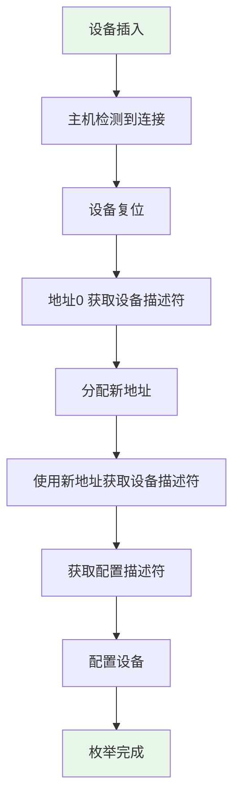
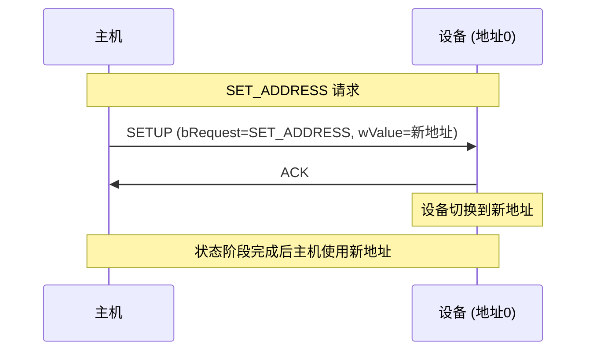
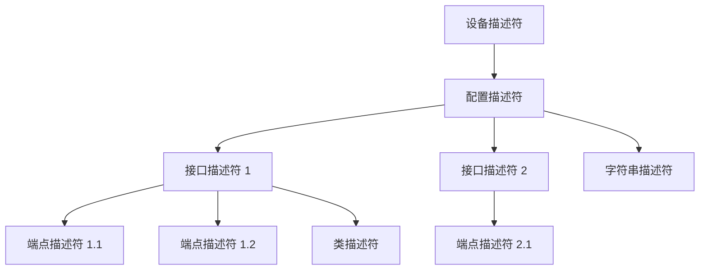
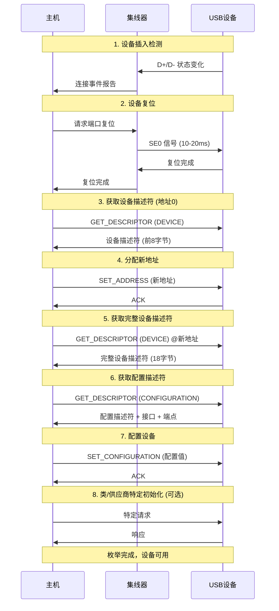
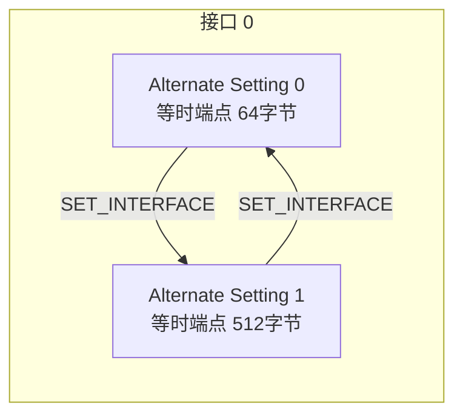

# USB 枚举过程

USB 枚举是主机识别和配置设备的过程，是 USB 通信的基础。本章详细讲解枚举的每个阶段和相关概念。

---

## 2.1 枚举概述

USB 枚举（Enumeration）是主机获取设备信息、加载驱动、配置设备的过程。设备插入后，主机通过一系列控制传输获取设备描述符、配置描述符等信息，最终使设备进入配置状态。



⚠️ **注意**：枚举是 USB 通信的前提，枚举失败则设备无法使用。排查 USB 问题时，枚举往往是首要关注点。

---

## 2.2 设备插入检测

### 2.2.1 D+/D- 上拉电阻

设备通过在 D+ 或 D- 上拉电阻来报告其速度类型：

| 速度类型 | 上拉电阻位置 | 主机检测逻辑 |
|----------|--------------|--------------|
| 低速 | D- (1.5kΩ to VBUS) | D- 拉高，D+ 低 |
| 全速 | D+ (1.5kΩ to VBUS) | D+ 拉高，D- 低 |
| 高速 | D+ (45kΩ to GND) | 高速设备先以全速检测，再进行高速协商 |

### 2.2.2 连接检测

主机通过集线器检测端口状态变化。设备连接后，集线器向主机报告连接事件。主机控制器开始对设备进行复位操作。

---

## 2.3 设备复位

设备复位（Reset）是枚举的关键步骤，通过以下方式触发：

1. 主机发送 SE0（Single-Ended 0，即 D+ 和 D- 都为低电平）信号
2. 复位持续时间为 10-20ms
3. 复位后，设备进入默认地址状态（地址为 0）
4. 设备的所有寄存器和状态恢复为默认

⚠️ **注意**：复位期间设备应能正确响应地址 0 的请求。某些设备在复位期间可能无法正确响应，这是枚举失败的常见原因。

---

## 2.4 地址分配

### 2.4.1 获取设备描述符（地址0）

复位后，主机使用默认地址 0 与设备通信，发送 GET_DESCRIPTOR 请求获取设备描述符的前 8 字节（或 18 字节）。

设备描述符的关键字段：

```c
struct usb_device_descriptor {
    uint8_t  bLength;             // 描述符长度 (18)
    uint8_t  bDescriptorType;     // 描述符类型 (DEVICE=0x01)
    uint16_t bcdUSB;               // USB 规范版本 (如 0x0200 = USB 2.0)
    uint8_t  bDeviceClass;         // 设备类 (如 0x00 = 接口决定)
    uint8_t  bDeviceSubClass;     // 设备子类
    uint8_t  bDeviceProtocol;      // 设备协议
    uint8_t  bMaxPacketSize0;     // 端点0最大包大小 (8/16/32/64)
    uint16_t idVendor;             // 厂商 ID
    uint16_t idProduct;            // 产品 ID
    uint16_t bcdDevice;            // 设备版本号
    uint8_t  iManufacturer;        // 厂商字符串索引
    uint8_t  iProduct;             // 产品字符串索引
    uint8_t  iSerialNumber;        // 序列号字符串索引
    uint8_t  bNumConfigurations;  // 配置数量
};
```

### 2.4.2 分配新地址

主机收到设备描述符后，为设备分配一个唯一的地址（1-127）。地址分配通过 SET_ADDRESS 请求完成。



⚠️ **注意**：SET_ADDRESS 请求在状态阶段完成前，设备仍使用地址 0 响应。状态阶段完成后，新地址才生效。

---

## 2.5 描述符体系

USB 描述符是设备向主机报告其功能和配置的数据结构。



### 2.5.1 设备描述符 (Device Descriptor)

每个设备只有一个设备描述符，包含设备基本信息。关键字段：

- `bMaxPacketSize0`：端点 0 最大包大小，决定控制传输效率
- `idVendor` 和 `idProduct`：厂商和产品 ID，用于匹配驱动程序
- `bNumConfigurations`：设备支持的配置数量

### 2.5.2 配置描述符 (Configuration Descriptor)

每个配置描述符定义了设备的一种工作配置：

```c
struct usb_configuration_descriptor {
    uint8_t  bLength;             // 描述符长度 (9)
    uint8_t  bDescriptorType;     // CONFIGURATION=0x02
    uint16_t wTotalLength;        // 配置描述符+所有接口+端点总长度
    uint8_t  bNumInterfaces;      // 接口数量
    uint8_t  bConfigurationValue; // 配置值 (用于SET_CONFIGURATION)
    uint8_t  iConfiguration;      // 配置字符串索引
    uint8_t  bmAttributes;        // 属性 (位7=1,位5=自供电,位4=远程唤醒)
    uint8_t  bMaxPower;           // 最大电流 (单位 2mA)
};
```

⚠️ **注意**：`bMaxPower` 单位为 2mA，例如 0x32 = 50 × 2mA = 100mA。USB 2.0 设备默认总线供电最大 100mA（可配置 0-100mA）。

### 2.5.3 接口描述符 (Interface Descriptor)

接口描述符定义设备的一组功能：

```c
struct usb_interface_descriptor {
    uint8_t bLength;              // 描述符长度 (9)
    uint8_t bDescriptorType;      // INTERFACE=0x04
    uint8_t bInterfaceNumber;     // 接口号
    uint8_t bAlternateSetting;    // 备用设置号
    uint8_t bNumEndpoints;        // 端点数量（不含 EP0）
    uint8_t bInterfaceClass;      // 接口类 (HID=0x03, CDC=0x02, etc.)
    uint8_t bInterfaceSubClass;   // 接口子类
    uint8_t bInterfaceProtocol;   // 接口协议
    uint8_t iInterface;           // 接口字符串索引
};
```

### 2.5.4 端点描述符 (Endpoint Descriptor)

端点描述符定义每个端点的特性：

```c
struct usb_endpoint_descriptor {
    uint8_t bLength;              // 描述符长度 (7)
    uint8_t bDescriptorType;      // ENDPOINT=0x05
    uint8_t bEndpointAddress;     // 端点地址 (bit7:方向, bit0-3:端点号)
    uint8_t bmAttributes;         // 端点属性 (bit0-1:传输类型)
    uint16_t wMaxPacketSize;      // 最大包大小
    uint8_t bInterval;            // 轮询间隔 (等时/中断端点)
};
```

⚠️ **注意**：端点地址格式中，bit7=1 表示 IN（设备到主机），bit7=0 表示 OUT（主机到设备）。

### 2.5.5 字符串描述符 (String Descriptor)

字符串描述符提供可读的产品信息：

```c
struct usb_string_descriptor {
    uint8_t bLength;              // 描述符长度
    uint8_t bDescriptorType;      // STRING=0x03
    uint16_t wData[];             // Unicode 字符串
};
```

字符串描述符可选，但提供 iManufacturer、iProduct、iSerialNumber 可增强用户体验。

---

## 2.6 完整枚举流程



---

## 2.7 配置与 Alternate Setting

### 2.7.1 配置选择

主机通过 SET_CONFIGURATION 请求选择设备配置。设备收到非零配置值后，进入配置状态，所有接口激活。

```c
// 配置值
// 0: 取消配置，设备回到地址状态
// 1-255: 配置值
```

⚠️ **注意**：设备只能有一个配置处于激活状态。切换配置会重置所有端点。

### 2.7.2 Alternate Setting

同一接口可以有多个 Alternate Setting，用于动态切换接口配置：



使用场景：
- 视频设备：切换不同分辨率/帧率
- 音频设备：切换不同采样率/位深
- 自定义需求：动态调整带宽分配

---

## 2.8 类驱动加载

枚举完成后，主机根据设备或接口的类代码加载相应的类驱动。

### 2.8.1 驱动匹配顺序

1. **设备级匹配**：根据 idVendor + idProduct 匹配特定设备驱动
2. **接口级匹配**：根据 bInterfaceClass + bInterfaceSubClass + bInterfaceProtocol 匹配类驱动
3. **兼容ID匹配**：使用兼容ID列表匹配

### 2.8.2 常见类代码

| 类代码 | 类名 | 典型设备 |
|--------|------|----------|
| 0x00 | 接口特定 | 保留 |
| 0x01 | 音频 (Audio) | 声卡、麦克风 |
| 0x02 | 通信 (CDC) | 调制解调器、虚拟串口 |
| 0x03 | 人机接口 (HID) | 键盘、鼠标、游戏手柄 |
| 0x05 | 物理 (Physical) | 力反馈设备 |
| 0x06 | 图像 (Image) | 扫描仪、相机 |
| 0x07 | 打印机 (Printer) | 打印机 |
| 0x08 | 大容量存储 (Mass Storage) | U盘、移动硬盘 |
| 0x09 | 集线器 (Hub) | USB Hub |
| 0x0A | CDC-Data | CDC 数据类 |
| 0x0B | 智能卡 (Smart Card) | 读卡器 |
| 0x0D | 内容安全 (Content Security) | DRM设备 |
| 0x0E | 视频 (Video) | 摄像头、显示器 |
| 0x0F | 医疗设备 (Personal Healthcare) | 医疗设备 |
| 0x10 | 音频/视频 (Audio/Video) | 音视频设备 |
| 0xDC | 诊断设备 (Diagnostic) | 诊断设备 |
| 0xE0 | 无线控制器 (Wireless) | 蓝牙适配器 |
| 0xEF | 杂项 (Miscellaneous) | 复合设备 |
| 0xFE | 应用程序特定 (Application Specific) | DFU、固件升级 |
| 0xFF | 厂商特定 (Vendor Specific) | 自定义设备 |

---

## 📝 本章面试题

### 1. USB 枚举的完整流程是什么？

**参考答案**：设备插入 → 主机检测到连接 → 设备复位 → 使用地址0获取设备描述符（8字节）→ 分配新地址 → 使用新地址获取完整设备描述符 → 获取配置描述符 → 发送 SET_CONFIGURATION → 枚举完成。

### 2. 设备描述符中的 bDeviceClass=0 表示什么？

**参考答案**：bDeviceClass=0 表示设备的类信息由接口描述符决定，由各接口的 bInterfaceClass 决定所属类。这是复合设备的常见做法。

### 3. 为什么高速设备要先以全速模式检测？

**参考答案**：因为主机控制器在复位后首先以全速模式进行通信。高速设备需要检测主机发送的 Chirp 信号（高速模式特征），如果主机支持高速则进行高速协商，否则降级为全速运行。

### 4. SET_ADDRESS 和 SET_CONFIGURATION 的区别是什么？

**参考答案**：SET_ADDRESS 为设备分配唯一地址，使设备从默认地址 0 转换到指定地址。SET_CONFIGURATION 激活设备的某个配置，使设备从地址状态转换到配置状态。只有配置后的端点才能进行数据传输。

### 5. 什么是 Alternate Setting？如何使用？

**参考答案**：Alternate Setting 是同一接口的多个可选配置，用于动态切换接口的工作模式。通过 SET_INTERFACE 请求切换，可改变端点特性（如最大包大小）或禁用/启用接口。在音视频设备中常用于切换分辨率或采样率。

---

## ⚠️ 开发注意事项

1. **设备描述符必须在地址 0 可用**：枚举初期主机只能通过地址 0 访问设备，此时必须能正确响应 GET_DESCRIPTOR。

2. **端点 0 最大包大小需匹配**：固件需根据实际能力设置 bMaxPacketSize0，高速模式通常为 64 字节。

3. **配置描述符的 wTotalLength**：此字段必须正确反映配置描述符、接口描述符、端点描述符的总长度。

4. **类驱动加载失败的处理**：设备应能响应标准的 USB 请求，即使类驱动未加载也能返回正确的 stall。

5. **配置后的功耗**：进入配置状态后，设备功耗不能超过配置描述符中声明的 bMaxPower 值。

6. **复合设备的配置**：复合设备有多个接口，需要正确设置接口关联描述符（IAD）来标识功能组。
