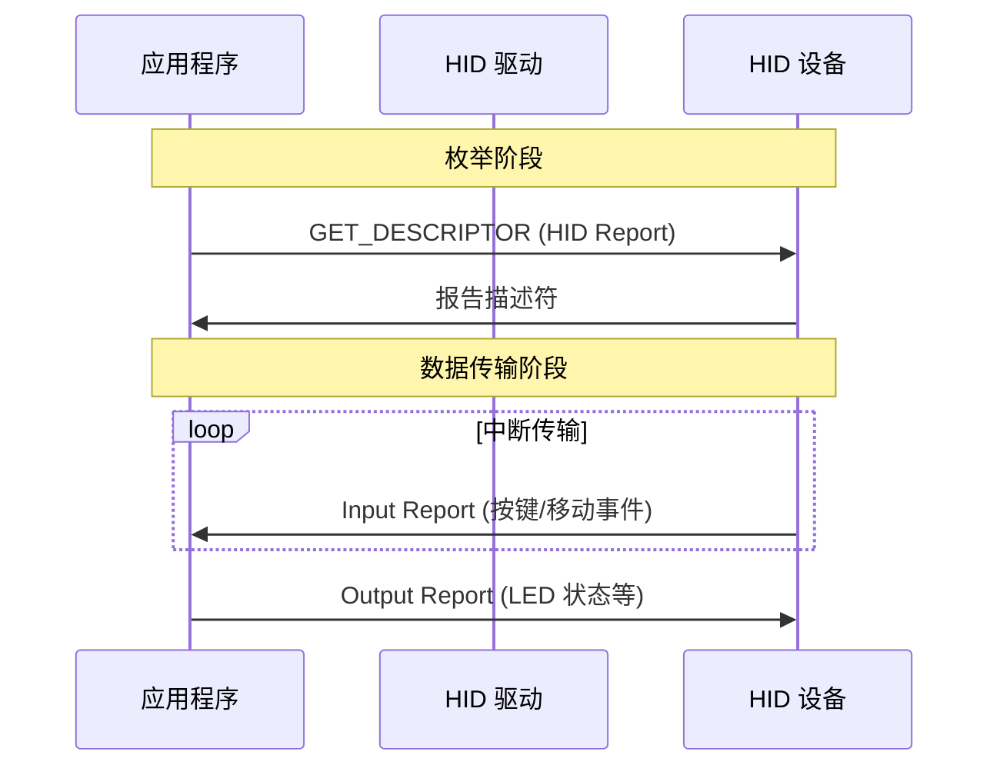
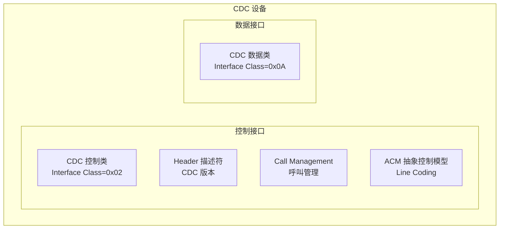
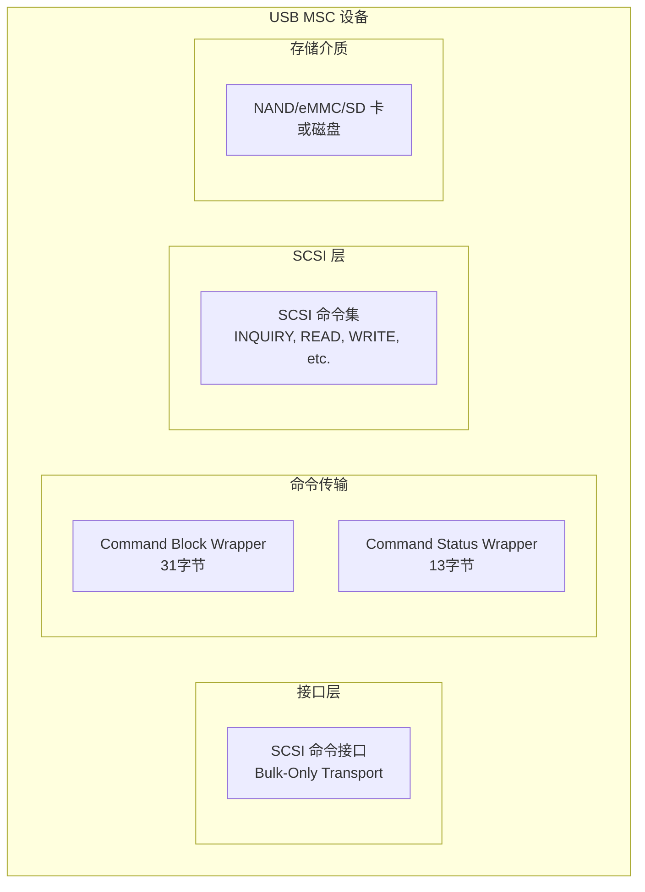
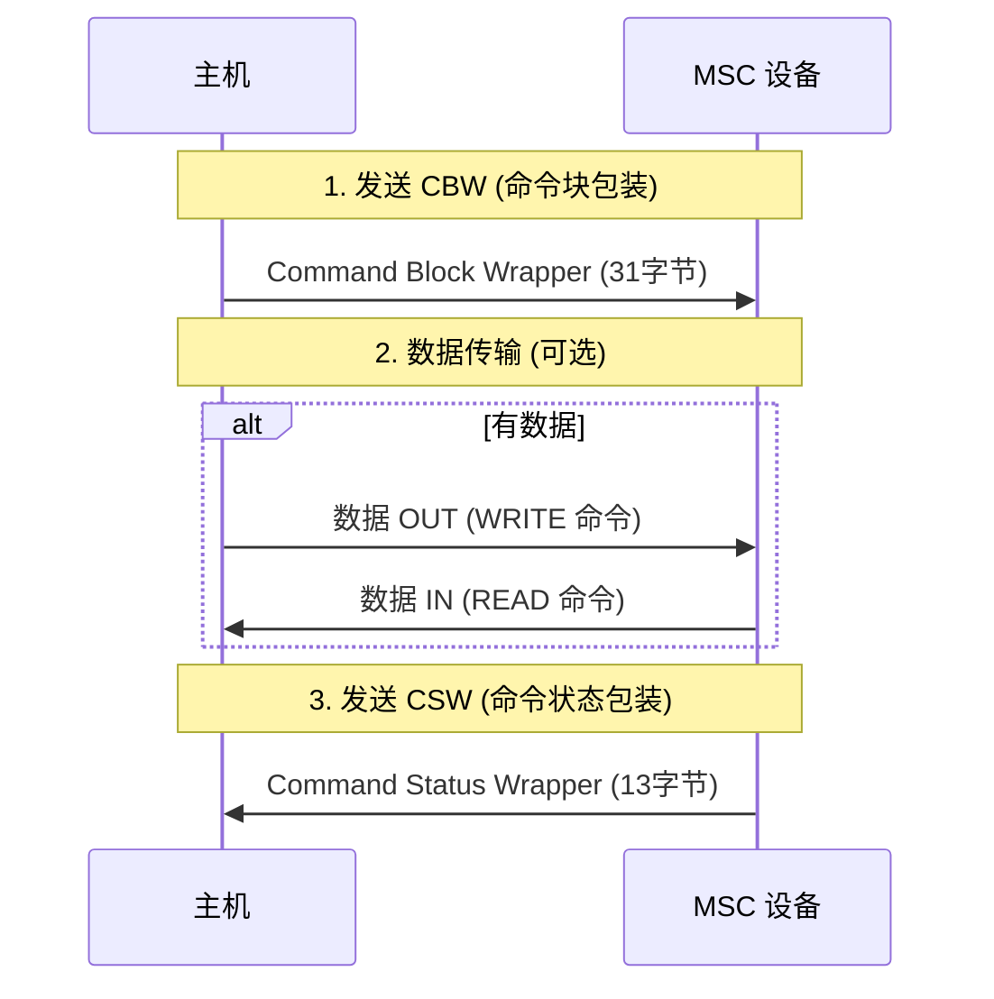
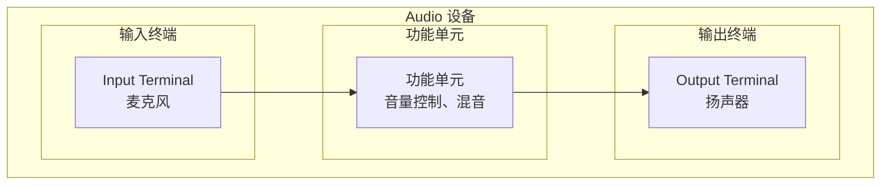

# USB 类驱动

USB 类驱动（Class Driver）是针对特定设备类型的通用驱动，使得应用程序可以使用统一的接口与不同厂商的同类设备通信。本章介绍常见的 USB 类及其工作原理。

---

## 3.1 HID 类 (Human Interface Device)

HID 类是应用最广泛的 USB 类之一，用于键盘、鼠标、游戏手柄等人体学接口设备。

### 3.1.1 HID 设备特点

- **协议简单**：固件实现相对简单
- **Boot Protocol**：支持 BIOS 启动模式，兼容老旧系统
- **报告描述符**：灵活的数据格式定义
- **中断传输**：小数据量、高可靠性

### 3.1.2 HID 描述符结构

HID 设备除了标准描述符外，还包含 HID 描述符和报告描述符：

```c
// HID 描述符
struct hid_descriptor {
    uint8_t  bLength;             // 描述符长度 (9)
    uint8_t  bDescriptorType;    // HID=0x21
    uint16_t bcdHID;              // HID 版本 (如 0x0111 = 1.11)
    uint8_t  bCountryCode;        // 国家代码 (0 = 不支持)
    uint8_t  bNumDescriptors;     // 下级描述符数量
    uint8_t  bDescriptorType2;    // 下级描述符类型 (REPORT=0x22)
    uint16_t wDescriptorLength;  // 下级描述符长度
};
```

### 3.1.3 报告描述符

报告描述符定义了 HID 设备的数据格式，采用树形结构描述：

```c
// 键盘报告示例 (8字节)
// Byte 0: 修饰键 (Ctrl, Shift, Alt, GUI)
// Byte 1: 保留
// Bytes 2-7: 按键码 (最多6个同时按键)

// 鼠标报告示例 (4字节)
// Byte 0: 按钮状态
// Byte 1: X 轴移动 (有符号)
// Byte 2: Y 轴移动 (有符号)
// Byte 3: 滚轮 (有符号)
```

⚠️ **注意**：报告描述符的解析比较复杂，建议使用 HID Descriptor Tool (DCT) 工具生成。

### 3.1.4 HID 交互流程



---

## 3.2 CDC 类 (Communication Device Class)

CDC 类用于通信设备，将 USB 虚拟为串口（COM 口），实现数据传输。

### 3.2.1 CDC 模型

CDC 采用抽象控制模型（ACM），将设备分为：

- **控制接口 (Communication Interface)**：管理连接、Line Coding 等
- **数据接口 (Data Interface)**：实际数据传输



### 3.2.2 CDC 控制请求

CDC 定义了多个控制请求：

| 请求 | 功能 |
|------|------|
| SET_LINE_CODING | 设置波特率、停止位、校验位等 |
| GET_LINE_CODING | 获取当前 Line Coding |
| SET_CONTROL_LINE_STATE | 设置 DTR、RTS 等控制信号 |
| SEND_BREAK | 发送 break 信号 |

### 3.2.3 Line Coding 格式

```c
struct line_coding {
    uint32_t dwDTERate;    // 波特率 (9600, 115200 等)
    uint8_t  bCharFormat;  // 停止位 (0=1位, 1=1.5位, 2=2位)
    uint8_t  bParityType;  // 校验位 (0=无, 1=奇, 2=偶, 3=标记, 4=空格)
    uint8_t  bDataBits;    // 数据位 (5, 6, 7, 8, 16)
};
```

⚠️ **注意**：CDC 虚拟串口的波特率设置只是通知设备，实际数据传输速率仍由 USB 带宽决定。设备应忽略不合理的波特率值。

---

## 3.3 Mass Storage 类 (MSC)

Mass Storage 类用于存储设备，如 U 盘、移动硬盘、存储卡读卡器等。

### 3.3.1 MSC 架构

MSC 采用 SCSI 命令集，支持多种存储介质：



### 3.3.2 Bulk-Only 传输协议

MSC 使用批量传输（Bulk-Only）传输数据，不使用中断或控制传输（除了类特定请求）：



### 3.3.3 CBW 格式

```c
struct command_block_wrapper {
    uint32_t dCBWSignature;     // 签名 (0x43425355 = "CBWS")
    uint32_t dCBWTag;           // 命令标签 (用于匹配 CSW)
    uint32_t dCBWDataTransferLength; // 数据长度
    uint8_t  bmCBWFlags;        // 方向 (bit7: 0=OUT, 1=IN)
    uint8_t  bCBWLUN;           // LUN 号
    uint8_t  bCBWCBLength;     // 命令块长度 (1-16)
    uint8_t  CBWCB[16];         // SCSI 命令
};
```

### 3.3.4 常见 SCSI 命令

| 命令 | 功能 | 数据方向 |
|------|------|----------|
| INQUIRY | 查询设备信息 | 设备→主机 |
| READ_CAPACITY | 查询存储容量 | 设备→主机 |
| READ(10) | 读取数据块 | 设备→主机 |
| WRITE(10) | 写入数据块 | 主机→设备 |
| TEST_UNIT_READY | 检查设备就绪 | 无 |
| REQUEST_SENSE | 获取错误信息 | 设备→主机 |

⚠️ **注意**：MSC 设备的逻辑单元号（LUN）通常为 0。某些读卡器支持多个 LUN，对应多个存储卡槽位。

---

## 3.4 DFU 类 (Device Firmware Upgrade)

DFU 类用于设备固件升级，允许在不拆开设备的情况下更新固件。

### 3.4.1 DFU 工作模式

DFU 有两种工作模式：

- **DFU 模式**：设备进入固件升级状态，等待主机发送固件数据
- **运行时模式**：设备正常工作，DFU 功能可用

### 3.4.2 DFU 状态机

```mermaid
stateDiagram-v2
    [*] --> dfuIDLE
    dfuIDLE --> dfuDNLOAD-IDLE: DNLOAD
    dfuDNLOAD-IDLE --> dfuDNLOAD: 传输数据
    dfuDNLOAD --> dfuDNLOAD-IDLE: 更多数据
    dfuDNLOAD-IDLE --> dfuMANIFEST: 无更多数据
    dfuMANIFEST --> dfuMANIFEST-WAIT: 验证固件
    dfuMANIFEST-WAIT --> dfuIDLE: 完成
    dfuIDLE --> dfuUPLOAD: UPLOAD
    dfuUPLOAD --> dfuIDLE: 完成
    dfuIDLE --> dfuDETACH: DETACH
```

### 3.4.3 DFU 请求

| 请求 | 功能 |
|------|------|
| DETACH | 切换到 DFU 模式 |
| DNLOAD | 下载固件数据块 |
| UPLOAD | 上传固件数据块（可选）|
| GETSTATUS | 获取操作状态 |
| GETSTATE | 获取当前状态 |
| CLEARSTATUS | 清除状态 |

### 3.4.4 DFU 描述符

```c
struct dfu_function_descriptor {
    uint8_t  bLength;             // 9
    uint8_t  bDescriptorType;    // DFU_FUNCTIONAL=0x21
    uint8_t  bmAttributes;       // 位特性
    uint16_t wDetachTimeOut;     // 等待超时 (ms)
    uint16_t wTransferSize;      // 最大传输块大小
    uint16_t bcdDFUVersion;      // DFU 版本 (1.1 = 0x0110)
};
```

⚠️ **注意**：DFU 升级过程中断可能导致设备变砖，需要设计 Bootloader 恢复机制。

---

## 3.5 Audio 类

Audio 类用于音频设备，如声卡、麦克风、扬声器等。

### 3.5.1 Audio 设备拓扑

Audio 设备采用实体/终端（Entity/Terminal）模型：



### 3.5.2 Audio 控制请求

| 请求 | 功能 |
|------|------|
| SET_CUR | 设置当前值 |
| GET_CUR | 获取当前值 |
| SET_MIN | 设置最小值 |
| GET_MIN | 获取最小值 |
| SET_MAX | 设置最大值 |
| GET_MAX | 获取最大值 |

---

## 3.6 类驱动选择原则

选择 USB 类时需考虑以下因素：

| 因素 | 考虑点 |
|------|--------|
| 设备类型 | 是否已有成熟类定义 |
| 数据特性 | 实时性 vs 可靠性 |
| 驱动支持 | 主机端驱动可用性 |
| 开发复杂度 | 现有库/例程支持 |

⚠️ **注意**：如果标准类无法满足需求，可以使用厂商特定类（bInterfaceClass = 0xFF）。

---

## 📝 本章面试题

### 1. HID 类和 CDC 类的主要区别是什么？

**参考答案**：HID 类主要用于人机交互设备（键盘、鼠标），使用中断传输，数据量小但可靠性要求高，报告描述符定义数据格式。CDC 类用于通信设备，虚拟串口模型，使用批量传输，数据量大但允许一定延迟。

### 2. MSC 设备的 Bulk-Only 传输协议是什么？

**参考答案**：Bulk-Only 协议包括三个阶段：发送 CBW（命令块包装）→ 传输数据（可选）→ 接收 CSW（命令状态包装）。CBW 包含 SCSI 命令，CSW 返回执行结果。

### 3. HID 报告描述符的作用是什么？

**参考答案**：HID 报告描述符定义了 HID 设备发送和接收数据的格式。采用树形结构描述各数据字段的用途、长度、值域等信息，使主机能够正确解析 HID 报告数据。

### 4. DFU 升级过程中断会怎样？如何防止？

**参考答案**：DFU 升级过程中断可能导致固件不完整或 bootloader 损坏，设备无法启动。防止措施包括：双 bank 固件备份、校验和验证、超时恢复、bootloader 恢复模式。

### 5. 为什么 CDC 虚拟串口的波特率设置不影响实际传输速率？

**参考答案**：CDC 的 Line Coding 设置只是通知设备主机期望的"虚拟"波特率，实际数据传输速率由 USB 带宽决定。设备收到设置后应调整内部采样率以匹配虚拟波特率，但 USB 传输不受影响。

---

## ⚠️ 开发注意事项

1. **HID 报告描述符错误**：描述符解析错误会导致设备无法识别或功能异常，务必使用工具验证。

2. **CDC 接口顺序**：CDC 设备通常需要控制接口在前、数据接口在后，否则可能无法正确枚举。

3. **MSC 的逻辑块寻址**：存储设备通常使用 LBA（逻辑块寻址），块大小通常为 512 字节。

4. **DFU 分离**：设备进入 DFU 模式前应保存上下文，确保可以从正常模式触发 DFU。

5. **Audio 端点配置**：音频数据通常使用等时端点，需要正确设置采样率、位深和通道数。
