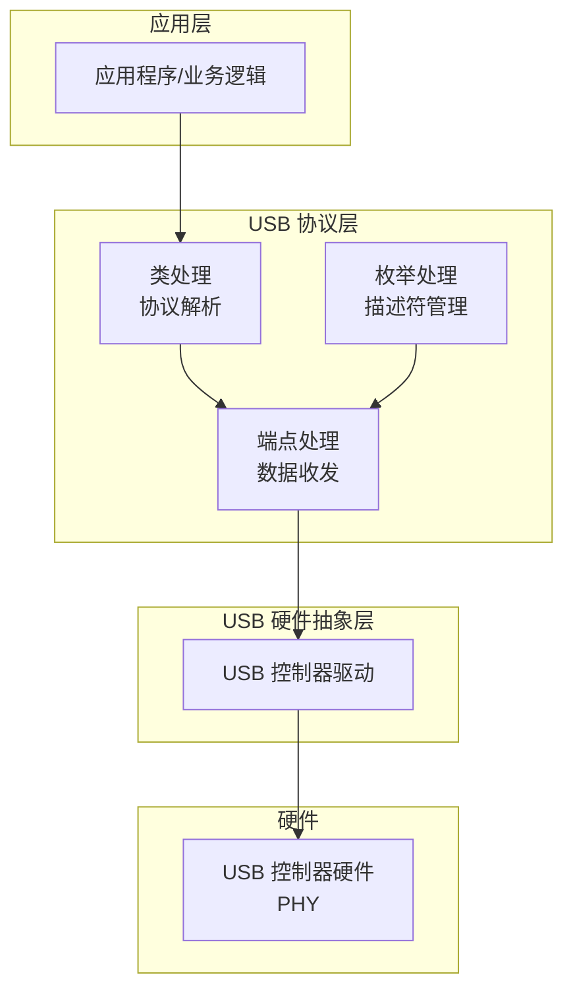
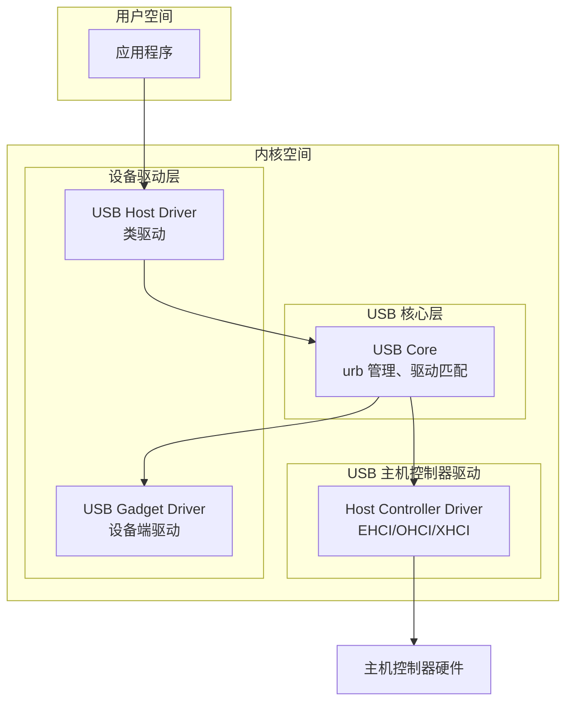
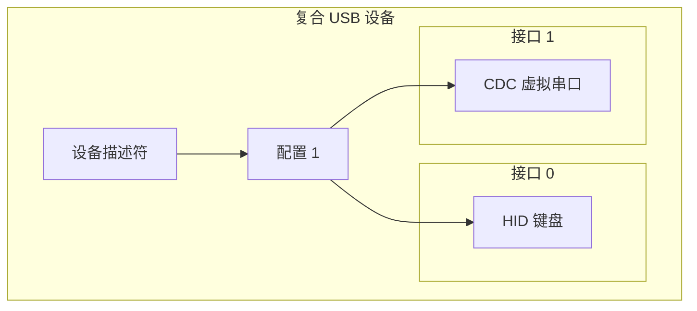
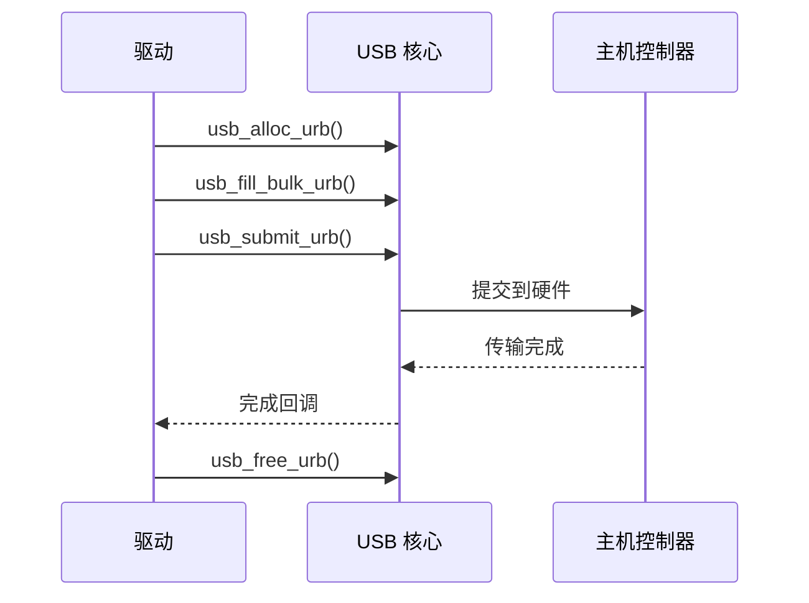

# USB 驱动开发

本章介绍 USB 驱动开发的核心概念，包括设备端固件开发和主机端驱动架构。

---

## 4.1 USB 设备端开发

### 4.1.1 固件架构

USB 设备端固件通常包含以下模块：



### 4.1.2 描述符实现

设备固件需要实现完整的描述符结构：

```c
// 设备描述符
const struct usb_device_descriptor device_descriptor = {
    .bLength = sizeof(device_descriptor),
    .bDescriptorType = USB_DTYPE_DEVICE,
    .bcdUSB = 0x0200,
    .bDeviceClass = USB_CLASS_PER_INTERFACE,
    .bDeviceSubClass = 0,
    .bDeviceProtocol = 0,
    .bMaxPacketSize0 = 64,
    .idVendor = 0x1234,
    .idProduct = 0x5678,
    .bcdDevice = 0x0100,
    .iManufacturer = 1,
    .iProduct = 2,
    .iSerialNumber = 3,
    .bNumConfigurations = 1,
};

// 配置描述符
const struct usb_configuration_descriptor config_descriptor = {
    .bLength = sizeof(config_descriptor),
    .bDescriptorType = USB_DTYPE_CONFIGURATION,
    .wTotalLength = sizeof(config_descriptor) + sizeof(interface_descriptor) + sizeof(endpoint_out) + sizeof(endpoint_in),
    .bNumInterfaces = 1,
    .bConfigurationValue = 1,
    .iConfiguration = 0,
    .bmAttributes = 0x80,    // 总线供电
    .bMaxPower = 100,        // 100mA
};
```

### 4.1.3 端点初始化

设备端需要根据应用需求配置各端点：

```c
// 端点配置示例
void usb_endpoint_init(void) {
    // 控制端点 EP0 - 固件自动处理
    usb_ep0_init(64);

    // OUT 端点 - 批量接收
    usb_ep_configure(EP_BULK_OUT,
                     USB_EP_TYPE_BULK,
                     64,    // 最大包大小
                     callback_bulk_out);

    // IN 端点 - 批量发送
    usb_ep_configure(EP_BULK_IN,
                     USB_EP_TYPE_BULK,
                     64,
                     callback_bulk_in);
}
```

⚠️ **注意**：端点的最大包大小必须是有效值（8/16/32/64/512 等），且不能超过硬件能力。

---

## 4.2 USB 主机端驱动

### 4.2.1 Linux USB 驱动架构

Linux USB 驱动分为三层：



### 4.2.2 Linux USB 设备驱动模型

Linux USB 驱动使用 `usb_driver` 结构体注册：

```c
static struct usb_driver my_driver = {
    .name = "my_usb_driver",
    .probe = my_probe,
    .disconnect = my_disconnect,
    .id_table = my_id_table,  // 匹配列表
    .pre_reset = my_pre_reset,
    .post_reset = my_post_reset,
};

// 注册驱动
module_usb_driver(my_driver);
```

### 4.2.3 设备探测与初始化

```c
static int my_probe(struct usb_interface *intf,
                    const struct usb_device_id *id) {
    struct my_device *dev;
    struct usb_endpoint_descriptor *ep_in, *ep_out;

    // 分配设备结构
    dev = kzalloc(sizeof(*dev), GFP_KERNEL);
    if (!dev)
        return -ENOMEM;

    // 保存接口信息
    dev->interface = intf;
    usb_set_intfdata(intf, dev);

    // 获取端点信息
    // ... 端点解析代码 ...

    // 初始化urbs
    // ... urb 初始化代码 ...

    return 0;
}
```

---

## 4.3 复合设备

复合设备（Composite Device）是一个物理设备实现多个接口，每个接口对应一个功能。

### 4.3.1 复合设备结构



### 4.3.2 接口关联描述符 (IAD)

复合设备可以使用 IAD 明确标识功能组：

```c
struct usb_interface_assoc_descriptor {
    uint8_t bLength;           // 8
    uint8_t bDescriptorType;  // IAD=0x0B
    uint8_t bFirstInterface;  // 起始接口号
    uint8_t bInterfaceCount;  // 接口数量
    uint8_t bFunctionClass;    // 功能类
    uint8_t bFunctionSubClass; // 功能子类
    uint8_t bFunctionProtocol; // 功能协议
    uint8_t iFunction;         // 功能字符串
};
```

⚠️ **注意**：Windows 设备管理器对复合设备的显示依赖于正确的 IAD 描述符。

---

## 4.4 驱动框架对比

### 4.4.1 主流平台 USB 框架

| 平台 | 驱动框架 | 特点 |
|------|----------|------|
| Linux | usbcore + usb子系统 | 开源、生态完善 |
| Windows | WDF (KMDF/UMDF) | 官方框架、签名要求 |
| RTOS (FreeRTOS) | 各厂商实现 | 轻量、定制化 |
|裸机 | USB 库/直接操作 | 完全控制 |

### 4.4.2 Linux vs Windows 驱动开发

| 方面 | Linux | Windows |
|------|-------|---------|
| 驱动模型 | usb_driver | WDF/KMDF |
| 签名要求 | 无强制 | 必须签名 |
| 调试难度 | 较高 | 较高 |
| 开发周期 | 较短 | 较长 |

---

## 4.5 驱动程序开发要点

### 4.5.1 URB 生命周期

Linux USB 驱动通过 URB（USB Request Block）与硬件通信：



### 4.5.2 热插拔处理

```c
static int my_probe(struct usb_interface *intf, ...) {
    // 创建设备节点
    device_create(class, ...);

    // 注册中断处理
    // ...

    return 0;
}

static void my_disconnect(struct usb_interface *intf) {
    // 取消所有 pending urbs
    usb_kill_urb(dev->urb);

    // 注销中断处理
    // ...

    // 删除设备节点
    device_destroy(class, ...);

    // 释放资源
    kfree(dev);
}
```

### 4.5.3 错误处理

```c
void my_complete(struct urb *urb) {
    struct my_device *dev = urb->context;

    switch (urb->status) {
    case 0:
        // 成功，处理数据
        break;
    case -ENOENT:   // urb 被取消
    case -ECONNRESET: // 设备断开
    case -ESHUTDOWN: // 主机控制器关闭
        // 正常退出
        return;
    default:
        // 错误，重试
        usb_submit_urb(urb, GFP_ATOMIC);
        break;
    }
}
```

---

## 📝 本章面试题

### 1. USB 设备端固件开发的主要步骤是什么？

**参考答案**：主要步骤包括：实现描述符（设备、配置、接口、端点）、初始化 USB 控制器、配置端点、处理控制传输请求（枚举）、实现数据端点的收发处理、主循环/中断处理。

### 2. 复合设备和多个独立设备有什么区别？

**参考答案**：复合设备是一个物理 USB 设备，通过多个接口实现不同功能，共享一个 USB 地址和电源管理。多个独立设备则是多个物理设备，各自独立枚举和地址。复合设备节省 USB 端口，但驱动复杂度较高。

### 3. Linux USB 驱动的 probe 函数什么时候被调用？

**参考答案**：probe 函数在设备插入且驱动与设备匹配成功后调用。匹配依据包括：设备 ID（Vendor/Product）、接口类/子类/协议、驱动特定匹配函数。

### 4. 什么是 URB？它的生命周期是什么？

**参考答案**：URB (USB Request Block) 是 Linux USB 驱动与硬件通信的数据结构。生命周期：分配 (usb_alloc_urb) → 填充 (usb_fill_xxx_urb) → 提交 (usb_submit_urb) → 完成回调 → 释放 (usb_free_urb)。

### 5. Windows USB 驱动为什么需要签名？

**参考答案**：Windows 要求内核驱动必须签名，防止恶意驱动获取系统权限。从 Windows 10 1803 起，强制要求驱动签名，否则无法加载。

---

## ⚠️ 开发注意事项

1. **描述符一致性**：设备描述符、配置描述符、接口描述符、端点描述符的总长度必须与 wTotalLength 一致。

2. **端点方向**：IN 端点的地址最高位必须为 1，OUT 端点最高位为 0。

3. **内存对齐**：USB 缓冲区通常需要 DMA 对齐要求，特别是高速传输。

4. **并发安全**：多线程环境下访问 USB 设备需要适当的同步机制。

5. **电源管理**：进入低功耗模式前需保存状态，唤醒后恢复。

6. **驱动兼容性**：同一设备可能有多个驱动匹配，需要正确设置驱动优先级。
