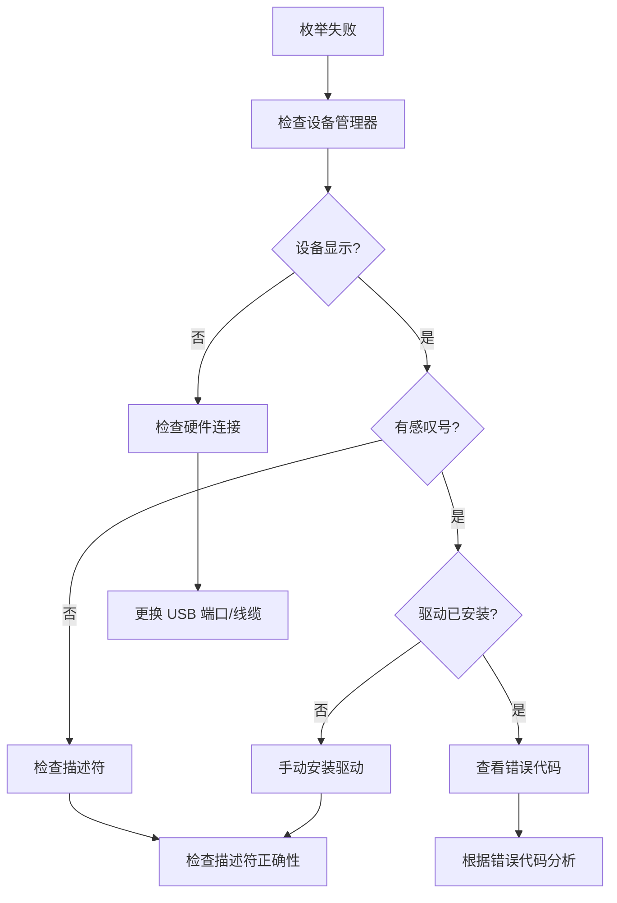
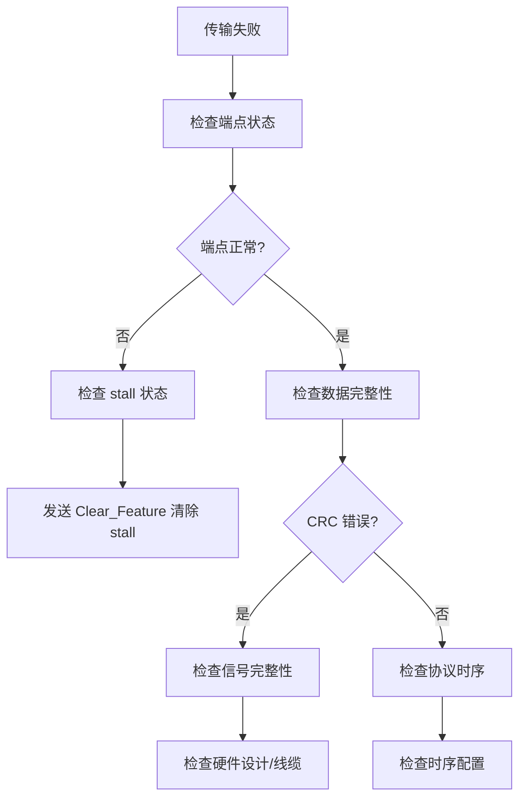

# USB 调试与排查

USB 问题排查需要系统化的方法和合适的工具。本章介绍常用的调试方法和问题定位技巧。

---

## 5.1 调试工具

### 5.1.1 软件工具

| 工具 | 平台 | 用途 |
|------|------|------|
| USBView | Windows | 查看设备描述符、端点配置 |
| Bus Hound | Windows | 协议分析、数据捕获 |
| Wireshark | 跨平台 | USB 协议解码 |
| usbmon | Linux | Linux USB 抓包 |
| lsusb | Linux | 列出 USB 设备 |
| usb-devices | Linux | 详细设备信息 |

### 5.1.2 USBView 使用

USBView 是 Windows SDK 自带的 USB 设备查看器，可以显示：
- 设备描述符详情
- 配置描述符
- 接口和端点信息
- 字符串描述符

⚠️ **注意**：USBView 显示的描述符信息是理解设备配置的重要参考，排查问题时首先应查看设备描述符是否符合预期。

### 5.1.3 Wireshark USB 抓包

Linux 下可以使用 usbmon 模块抓取 USB 数据包：

```bash
# 加载 usbmon 模块
sudo modprobe usbmon

# 查看可用接口
ls /sys/kernel/debug/usb/usbmon/

# 使用 Wireshark 抓包
sudo wireshark -i usbmon0
```

### 5.1.4 硬件工具

| 工具 | 功能 | 适用场景 |
|------|------|----------|
| 逻辑分析仪 | 捕获 D+/D- 信号时序 | 协议层问题 |
| USB 协议分析仪 | 协议解码、触发条件 | 复杂问题 |
| USB Hub with ports | 隔离问题端口 | 枚举问题 |
| 电流表 | 测量设备功耗 | 供电问题 |

---

## 5.2 枚举失败排查

### 5.2.1 排查流程



### 5.2.2 常见枚举错误

| 错误现象 | 可能原因 | 解决方法 |
|----------|----------|----------|
| 设备无响应 | 固件未运行、晶振问题 | 检查晶振频率、上电时序 |
| 枚举时复位 | 描述符错误、端点配置错误 | 检查描述符、减少端点 |
| 代码 10 | 驱动加载失败 | 检查类匹配、检查驱动 |
| 代码 43 | 设备驱动报告错误 | 查看设备日志 |
| 不断重新枚举 | 端点 stall 未清除 | 清除 stall 标志 |

### 5.2.3 描述符问题排查

⚠️ **常见描述符错误**：

1. **wTotalLength 不正确**：配置描述符总长度与实际不符
2. **bMaxPacketSize0 不匹配**：固件设置与描述符不一致
3. **端点地址错误**：IN/OUT 方向或端点号错误
4. **bNumEndpoints 错误**：声明的端点数量与实际不符

---

## 5.3 传输问题分析

### 5.3.1 数据传输失败



### 5.3.2 常见传输错误

| 错误类型 | 原因 | 解决方案 |
|----------|------|----------|
| NAK 重试 | 设备忙 | 增加重试次数 |
| CRC 错误 | 信号干扰 | 检查线缆质量 |
| Timeout | 设备无响应 | 检查设备状态 |
| Stall | 端点挂起 | 清除 stall |
| PID 错误 | 协议错误 | 检查固件 |

### 5.3.3 批量传输问题

批量传输问题排查要点：
- 检查端点是否正确配置为批量类型
- 确认 DMA 缓冲区对齐
- 验证最大包大小设置
- 检查数据 toggle 同步

### 5.3.4 中断传输问题

中断传输问题排查要点：
- 确认轮询间隔配置正确
- 检查主机是否按正确间隔查询
- 验证中断端点数据传输方向

---

## 5.4 性能问题

### 5.4.1 带宽问题

USB 带宽计算：
- 高速理论带宽：480 Mbps
- 每帧可用事务数：8 微帧 × 每微帧多个事务
- 实际吞吐量约为理论值的 70-80%

⚠️ **注意**：实际带宽受协议开销、事务调度、设备能力等多因素影响。

### 5.4.2 延迟问题

| 延迟类型 | 典型值 | 优化方法 |
|----------|--------|----------|
| 帧间隔 | 1ms (全速) / 125μs (高速) | 批量改为高速 |
| 中断轮询 | 1-255ms | 减少轮询间隔 |
| 端点延迟 | 硬件相关 | 优化固件处理 |
| 软件处理 | 驱动/OS | 优化驱动代码 |

### 5.4.3 传输效率优化

```c
// 优化示例：使用更大的包大小
// 假设高速批量端点
// 小包：64 字节 → 效率低
// 大包：512 字节 → 效率高

// 批量写入优化：合并多个小数据为一次传输
uint8_t buffer[512];
uint16_t offset = 0;

// 填充缓冲区
while (data_available && offset < sizeof(buffer)) {
    buffer[offset++] = get_next_byte();
}

// 一次传输
usb_ep_write(EP_BULK_IN, buffer, offset);
```

---

## 5.5 驱动问题

### 5.5.1 Linux USB 驱动调试

```bash
# 查看 USB 设备列表
lsusb
lsusb -v  # 详细信息

# 查看内核 USB 日志
dmesg | grep -i usb
dmesg | grep -i 'usb.*error'

# 查看特定设备
lsusb -d 1234:5678

# 查看设备描述符
usbview
```

### 5.5.2 Windows 驱动调试

```powershell
# 查看设备状态
Get-PnpDevice -Status Error

# 查看设备属性
devmgmt.msc  # 设备管理器

# 查看驱动日志
# 在注册表中查看
HKLM\SYSTEM\CurrentControlSet\Services\USB
```

### 5.5.3 驱动蓝屏分析

Windows 驱动问题可能导致蓝屏（BSOD），常见 USB 相关错误：

| 错误代码 | 含义 |
|----------|------|
| DRIVER_IRQL_NOT_LESS_OR_EQUAL | 驱动访问内存地址错误 |
| SYSTEM_THREAD_EXCEPTION_NOT_HANDLED | 驱动异常 |
| KERNEL_DATA_INPAGE_ERROR | 内存页错误 |
| USB_BUGCHECK | USB 控制器错误 |

---

## 5.6 调试技巧

### 5.6.1 固件调试

```c
// 添加调试输出
#ifdef DEBUG
#define USB_DEBUG(fmt, ...) \
    serial_printf("[USB] " fmt "\n", ##__VA_ARGS__)
#else
#define USB_DEBUG(...)
#endif

// 在关键位置添加调试
void usb_setup_packet_received(void) {
    USB_DEBUG("Setup packet received: %02x %02x",
              setup_packet.bRequest,
              setup_packet.wValue >> 8);
}
```

### 5.6.2 描述符验证

```c
// 验证描述符结构
void validate_descriptors(void) {
    // 检查设备描述符
    assert(device_descriptor.bLength == 18);
    assert(device_descriptor.bDescriptorType == 1);
    assert(device_descriptor.bNumConfigurations > 0);

    // 检查配置描述符
    uint16_t total = config_descriptor.wTotalLength;
    assert(total >= sizeof(struct usb_configuration_descriptor));
}
```

### 5.6.3 状态机调试

```c
// USB 状态跟踪
enum usb_state {
    STATE_DETACHED,
    STATE_ATTACHED,
    STATE_POWERED,
    STATE_DEFAULT,
    STATE_ADDRESS,
    STATE_CONFIGURED,
};

volatile enum usb_state current_state = STATE_DETACHED;

const char *state_names[] = {
    "DETACHED", "ATTACHED", "POWERED",
    "DEFAULT", "ADDRESS", "CONFIGURED"
};

void set_usb_state(enum usb_state new_state) {
    USB_DEBUG("State: %s -> %s",
              state_names[current_state],
              state_names[new_state]);
    current_state = new_state;
}
```

---

## 📝 本章面试题

### 1. 设备枚举失败时，如何快速定位问题？

**参考答案**：首先检查设备管理器状态，确认设备是否被识别；然后使用 USBView 查看描述符是否正确；检查固件是否正确响应 SETUP 包；验证描述符的 wTotalLength、bMaxPacketSize0 等关键字段；最后检查硬件连接和供电。

### 2. USB 传输出现 NAK 应该如何处理？

**参考答案**：NAK 表示设备暂时无法接收或发送数据，这是正常情况。处理方法：实现重试机制，在超时前多次尝试；分析 NAK 频率是否异常高；如果频繁 NAK，检查设备端处理能力是否足够。

### 3. 如何使用 Wireshark 调试 USB 问题？

**参考答案**：在 Linux 上加载 usbmon 模块，然后使用 Wireshark 选择 usbmon 接口抓包。可以过滤特定设备（usb.addr == xx:xx:xx:xx）、特定端点（usb.endpoint_number == x）、特定传输类型等。分析抓包数据时注意时间戳和错误标记。

### 4. 什么是 USB Stall？应该如何处理？

**参考答案**：Stall 表示端点无法继续处理请求，可能是错误条件或特殊功能。处理方法：发送 CLEAR_FEATURE 请求清除 stall；检查设备端固件逻辑是否正确响应请求；分析导致 stall 的原因并修复。

### 5. 如何排查 USB 设备间歇性断开连接？

**参考答案**：排查步骤：1) 检查供电是否稳定，测量 VBUS 电压；2) 检查 D+/D- 信号完整性；3) 检查固件是否正确处理断开事件；4) 检查驱动是否正确响应设备移除；5) 更换 USB 线缆和端口排除物理问题；6) 使用协议分析仪长时间监控。

---

## ⚠️ 开发注意事项

1. **调试时使用独立 USB 端口**：避免其他设备干扰调试。

2. **保留调试引脚**：预留 UART/I2C 等调试接口用于输出日志。

3. **版本管理**：记录每个版本的固件/驱动变更，便于回归测试。

4. **测试覆盖**：覆盖热插拔、长时间运行、异常断开等场景。

5. **日志记录**：在关键路径添加日志，便于问题回溯。

6. **工具校验**：定期校验调试工具的准确性，使用已知正常的设备验证工具。
