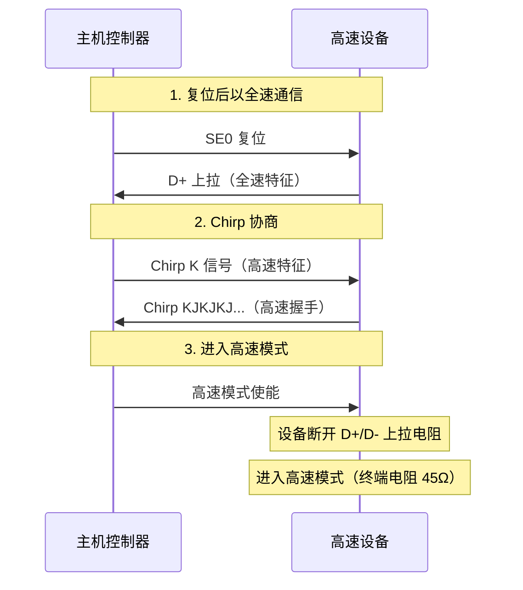
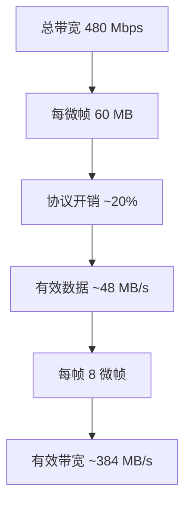
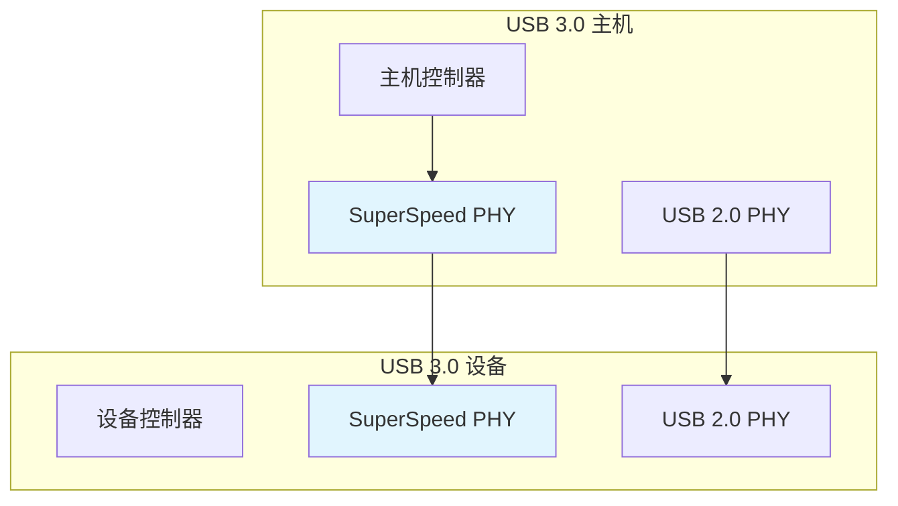

# USB 高速与超高速

本章介绍 USB 高速（High-Speed，480Mbps）和超高速（SuperSpeed，5Gbps+）的技术特点和开发要点。

---

## 6.1 高速 vs 全速

### 6.1.1 主要差异

| 特性 | 全速 (12 Mbps) | 高速 (480 Mbps) |
|------|----------------|-----------------|
| 传输速率 | 12 Mbps | 480 Mbps |
| 时间基准 | 帧 (1ms) | 微帧 (125μs) |
| 最大包大小 | 64 字节 (控制) | 512 字节 (批量) |
| 协议开销 | 约 30% | 约 20% |
| 信号类型 | 3.3V 差分 | 3.3V 差分 |
| 线缆要求 | 普通 | 需要高质量线缆 |

### 6.1.2 高速协商过程

设备插入后，高速设备需要与主机协商切换到高速模式：



⚠️ **注意**：高速协商失败会导致设备降级为全速模式运行。某些廉价设备或线缆可能导致协商不稳定。

---

## 6.2 事务调度

### 6.2.1 微帧调度

高速模式下，每帧（1ms）包含 8 个微帧（125μs）：

```mermaid
gantt
    title 高速 USB 微帧调度
    dateFormat X
    axisFormat %sms

    section 微帧 0
    同步事务/周期性 :0, 0.025
    批量事务 :0.025, 0.1

    section 微帧 1
    周期性 :0.125, 0.15
    批量事务 :0.15, 0.2

    section 微帧 2-7
    类似调度...
```

### 6.2.2 事务类型优先级

| 优先级 | 事务类型 | 说明 |
|--------|----------|------|
| 1 | 同步 (Isochronous) | 周期性，需要固定带宽 |
| 2 | 中断 (Interrupt) | 周期性，低延迟 |
| 3 | 控制 (Control) | 枚举和关键配置 |
| 4 | 批量 (Bulk) | 剩余带宽 |

---

## 6.3 带宽管理

### 6.3.1 带宽计算

高速带宽计算需要考虑：
- 每微帧最大事务数
- 协议开销（SYNC、CRC、EOP 等）
- 端点类型和最大包大小



### 6.3.2 带宽预留

周期性传输（等时和中断）需要预留带宽：

```c
// 带宽计算示例
uint32_t calculate_bandwidth(uint16_t max_packet_size,
                              uint8_t interval) {
    // 每帧事务数
    uint32_t transactions_per_frame;

    if (interval == 0) {  // 高速等时
        // 每微帧一次
        transactions_per_frame = 8 / interval;
    } else if (interval <= 8) {  // 高速中断
        transactions_per_frame = 8 / interval;
    } else {
        transactions_per_frame = 1;
    }

    // 带宽 = 包大小 × 事务数 / 帧时间
    return max_packet_size * transactions_per_frame / 1000; // bytes/us
}
```

⚠️ **注意**：高速主机控制器会为周期性端点预留带宽，如果请求的带宽超过可用带宽，SET_CONFIGURATION 会失败。

---

## 6.4 超高速 (SuperSpeed / USB 3.0)

### 6.4.1 技术规格

| 版本 | 速率 | 数据编码 | 通道 |
|------|------|----------|------|
| USB 3.0 | 5 Gbps | 8b/10b | 双向 |
| USB 3.1 | 10 Gbps | 128b/132b | 双向 |
| USB 3.2 | 20 Gbps | 128b/132b | 多通道 |

### 6.4.2 USB 3.0 架构变化

USB 3.0 采用双总线架构：
- **SuperSpeed 通道**：用于高速数据传输
- **USB 2.0 通道**：向后兼容（控制/低速/全速）



### 6.4.3 USB 3.0 端点

USB 3.0 引入新的端点类型：
- **同步 OUT 端点**：支持 PING 协议
- **批量 Stream**：支持多流传输

### 6.4.4 USB 3.0 电源管理

| 状态 | 功耗 | 唤醒时间 |
|------|------|----------|
| U0 | 正常工作 | - |
| U1 | < 250μW | < 10μs |
| U2 | < 100μW | < 10μs |
| U3 | < 100μW | < 10μs |

⚠️ **注意**：USB 3.0 设备的功耗管理更精细，支持多个低功耗状态。

---

## 6.5 协议效率优化

### 6.5.1 批量传输优化

```c
// 优化批量传输效率
void optimize_bulk_transfer(struct usb_device *dev) {
    // 使用最大包大小
    uint16_t mps = ep_config[EP_BULK_IN].max_packet_size;

    // 批量写入时填满每个包
    uint8_t buffer[512];
    uint32_t remaining = data_size;

    while (remaining > 0) {
        uint32_t to_send = min(remaining, mps);
        memcpy(buffer, data_ptr, to_send);
        usb_ep_write(dev->ep_bulk_in, buffer, to_send);

        remaining -= to_send;
        data_ptr += to_send;
    }
}
```

### 6.5.2 减少协议开销

1. **合并小数据**：将多个小请求合并为一次批量传输
2. **使用突发传输**：高速设备支持在一个微帧内多次传输
3. **选择合适端点类型**：实时数据用等时，大数据用批量

---

## 6.6 兼容性问题

### 6.6.1 高速设备降级

| 场景 | 行为 |
|------|------|
| 插入 USB 2.0 端口 | 降级为全速运行 |
| USB 2.0 Hub | 降级为全速运行 |
| 线缆质量差 | 可能降级为全速 |

### 6.6.2 超高速兼容

| 场景 | 行为 |
|------|------|
| USB 3.0 设备插入 USB 2.0 端口 | 仅使用 USB 2.0 通道 |
| USB 3.1 设备插入 USB 3.0 端口 | 降级为 5 Gbps |
| USB 3.2 设备插入 USB 3.1 端口 | 降级为 10 Gbps |

⚠️ **注意**：开发时需处理降级情况，确保基本功能在低速模式下可用。

### 6.6.3 常见高速/超高速问题

| 问题 | 原因 | 解决方案 |
|------|------|----------|
| 无法进入高速 | 端接电阻问题 | 检查硬件设计 |
| 频繁降级 | 线缆质量差 | 更换高质量线缆 |
| 传输不稳定 | 信号完整性问题 | 检查 PCB 设计 |
| USB 3.0 不识别 | 驱动问题 | 更新主机驱动 |

---

## 📝 本章面试题

### 1. 高速 USB 和全速 USB 的主要区别是什么？

**参考答案**：高速 USB 速率为 480Mbps，是全速的 40 倍；时间基准从 1ms 帧变为 125μs 微帧，每帧 8 个微帧；最大包大小增加到 512 字节；引入了 PING 协议和分割事务；信号质量要求更高。

### 2. 什么是 USB 高速协商过程？

**参考答案**：设备复位后首先以全速模式通信，主机发送 Chirp K 信号表示支持高速，设备回复 Chirp KJKJKJ 序列完成握手，然后主机使能高速模式，设备断开上拉电阻并接入高速终端电阻。

### 3. USB 3.0 相比 USB 2.0 有哪些改进？

**参考答案**：速率从 480Mbps 提升到 5/10/20Gbps；采用双总线架构，同时支持 SuperSpeed 和 USB 2.0；引入双向通道；支持更精细的电源管理（U1/U2/U3 状态）；增加了新的数据编码方式。

### 4. 为什么高速设备会降级为全速运行？

**参考答案**：常见原因包括：插入 USB 2.0 端口或集线器；线缆质量差导致信号完整性不足；设备或主机的高速 PHY 工作不正常；协商过程受到干扰。

### 5. USB 3.0 的双总线架构是什么？

**参考答案**：USB 3.0 设备包含两套 PHY：SuperSpeed PHY 用于 5/10/20Gbps 高速传输，USB 2.0 PHY 用于向后兼容（控制传输、低速、全速设备）。两个通道独立工作，可以同时传输数据。

---

## ⚠️ 开发注意事项

1. **高速硬件设计**：高速信号对 PCB 布局要求高，需要阻抗控制、差分对匹配、合理的信号完整性。

2. **线缆认证**：高速设备需要使用通过认证的 USB 3.0 线缆，否则可能导致降级或不稳定。

3. **降级兼容**：设计时应考虑设备降级到全速运行的情况，确保基本功能可用。

4. **驱动支持**：USB 3.0 设备需要正确安装 USB 3.0 驱动才能达到全速。

5. **功耗监控**：高速/超高速设备的功耗可能超过 100mA，需要在描述符中正确声明功耗值。

6. **热插拔处理**：高速连接断开时，主机和设备都需要正确处理链路状态变化。
