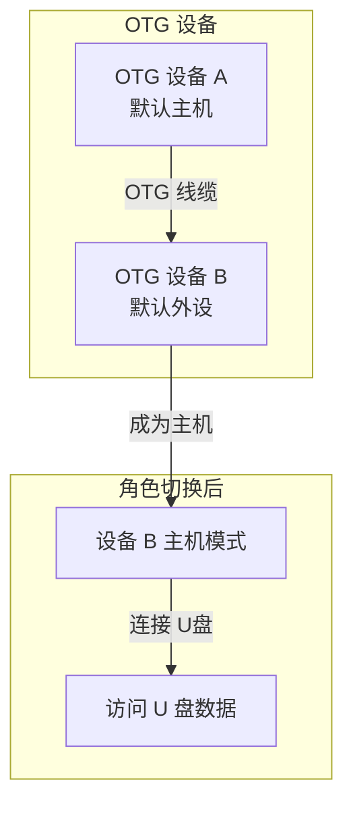
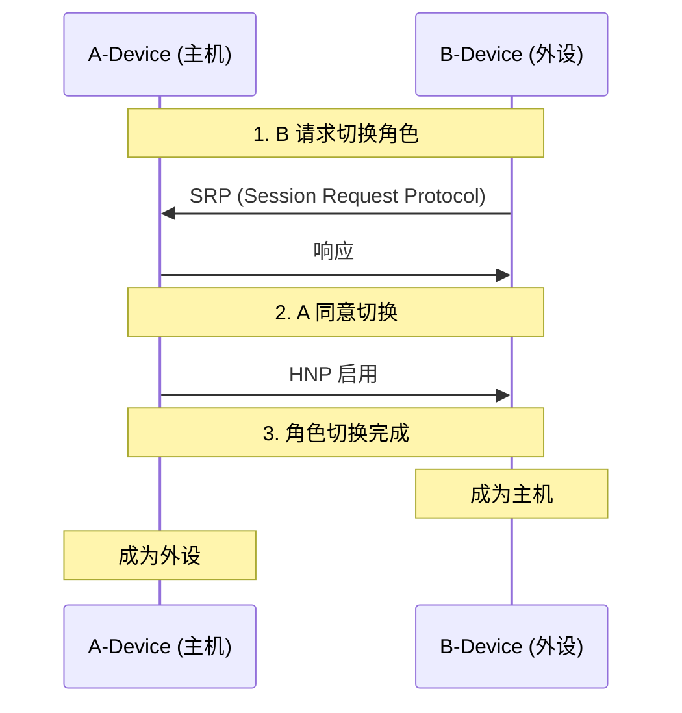
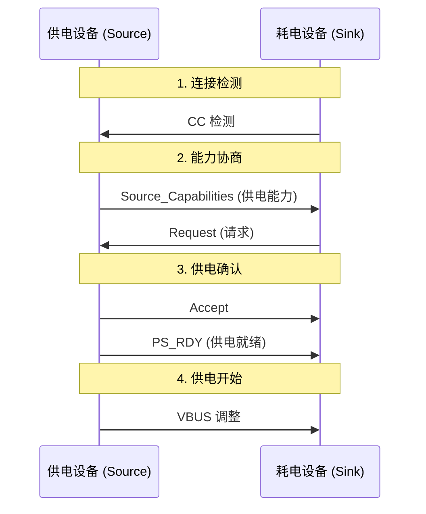
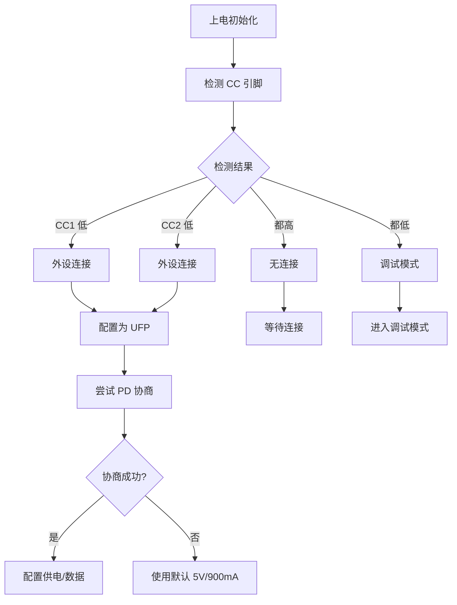

# OTG 与 Type-C

本章介绍 USB On-The-Go (OTG) 和 USB Type-C 接口技术，这是现代移动设备中广泛使用的技术。

---

## 7.1 USB OTG

### 7.1.1 OTG 概述

USB OTG 允许 USB 设备在主机（Host）和外设（Peripheral）角色之间切换，使手机、平板等设备可以直接与 U 盘、键盘等外设通信，无需电脑中转。



### 7.1.2 OTG 协议

#### ID 引脚

OTG 使用 micro-AB 接口的 ID 引脚区分角色：

| ID 引脚 | 角色 |
|---------|------|
| 接地 (ID=0) | 设备为默认主机 (A-Device) |
| 浮空 (ID=1) | 设备为默认外设 (B-Device) |

```mermaid
flowchart LR
    subgraph A-Device (主机)
        ID_A[ID 引脚接地]
    end

    subgraph B-Device (外设)
        ID_B[ID 引脚浮空]
    end

    ID_A ---|OTG 线缆| ID_B
```

#### HNP 协议 (Host Negotiation Protocol)

HNP 允许 OTG 设备在不插拔的情况下切换主机/外设角色：



#### SRP 协议 (Session Request Protocol)

SRP 允许外设请求主机启动供电会话，节省电量：

1. 外设通过 D+ 脉冲或 VBUS 检测请求会话
2. 主机响应并启动供电
3. 会话建立后可进行数据传输

### 7.1.3 OTG 描述符

OTG 设备需要额外的 OTG 描述符：

```c
struct otg_descriptor {
    uint8_t  bLength;           // 3
    uint8_t  bDescriptorType;  // OTG=0x09
    uint8_t  bmAttributes;      // 位特性
    // bit 0: SRP 支持
    // bit 1: HNP 支持
};
```

---

## 7.2 USB Type-C

### 7.2.1 Type-C 接口特性

Type-C 是新一代 USB 接口，具有以下特点：

| 特性 | 说明 |
|------|------|
| 可翻转 | 无论正反都可以插入 |
| 多协议 | 支持 USB、DisplayPort、Thunderbolt |
| 供电能力 | 可提供/接收最高 100W 电力 |
| 通道复用 | 使用通道配置 (CC) 引脚 |

### 7.2.2 Type-C 引脚定义

```mermaid
flowchart TB
    subgraph Type-C 母口 (24 针)
        CC1[CC1 - 通道配置]
        CC2[CC2 - 通道配置]
        Dp1[D++ - SuperSpeed 数据+]
        Dm1[D-- - SuperSpeed 数据-]
        Dp2[D++ - SuperSpeed 数据+]
        Dm2[D-- - SuperSpeed 数据-]
        VBUS[VBUS - 电源]
        GND[GND - 地]
    end

    subgraph 高速数据通道
        TX1+[TX1+]
        TX1-[TX1-]
        RX1+[RX1+]
        RX1-[RX1-]
        TX2+[TX2+]
        TX2-[TX2-]
        RX2+[RX2+]
        RX2-[RX2-]
    end
```

### 7.2.3 CC 通道

CC (Channel Configuration) 引脚用于检测连接、确定角色和配置供电：

```c
// CC 引脚状态
enum cc_status {
    CC_OPEN,         // 无设备连接
    CC_RA,           // 电阻检测 (Ra = 5.1kΩ)
    CC_RD,           // 电阻检测 (Rd = 5.1kΩ 下拉到地)
    CC_RP,           // 电阻检测 (Rp = 5.1kΩ 上拉到 VCC)
};

// CC 角色检测
void detect_cc_role(void) {
    if (cc1_state == CC_RD && cc2_state == CC_OPEN) {
        // 连接了 DFP (主机)
        role = DEVICE;
    } else if (cc1_state == CC_RP && cc2_state == CC_RP) {
        // 连接了 UFP (外设) 或无连接
        role = HOST;
    } else if (cc1_state == CC_RD && cc2_state == CC_RD) {
        // Debug 模式
        role = DEBUG;
    }
}
```

⚠️ **注意**：CC 引脚检测是 Type-C 的核心，错误检测可能导致设备损坏。

### 7.2.4 供电能力 (Power Delivery)

Type-C 支持多种供电配置文件 (Power Profile)：

| 规格 | 电压 | 最大电流 | 最大功率 |
|------|------|----------|----------|
| 默认 | 5V | 3A | 15W |
| PD 2.0/3.0 | 5/9/15/20V | 3A/5A | 15-100W |

---

## 7.3 USB Power Delivery

### 7.3.1 PD 协议

USB PD (Power Delivery) 是基于 CC 引脚的供电协商协议：



### 7.3.2 PD 消息格式

PD 协议使用 24 字节消息：

| 字段 | 长度 | 说明 |
|------|------|------|
| Preamble | 1 | 前导码 |
| SOP | 1 | 消息开始 |
| Header | 2 | 消息类型、长度 |
| Data | 0-36 | 数据对象 |
| CRC | 4 | 校验 |
| EOP | 1 | 消息结束 |

### 7.3.3 PD 数据对象

```c
// PD 供电能力数据对象
struct power_data_object {
    uint32_t supply:2;       // 供电类型
    uint32_t peak_current:2; // 峰值电流能力
    uint32_t voltage:10;     // 电压 (50mV 单位)
    uint32_t current:10;     // 电流 (10mA 单位)
    uint32_t reserved:8;     // 保留
};
```

---

## 7.4 模式切换

### 7.4.1 角色切换

Type-C 支持多种角色组合：

| DFP (主机) | UFP (外设) | 说明 |
|------------|------------|------|
| 供电 | 耗电 | 标准连接 |
| 耗电 | 供电 | 反向供电 |
| 供电 | 耗电 | DRP (双角色) |

### 7.4.2 替代模式 (Alternate Mode)

Type-C 支持替代模式，允许传输非 USB 协议：

| 替代模式 | 协议 |
|----------|------|
| DisplayPort | 视频输出 |
| Thunderbolt | 高速数据/视频 |
| HDMI | 视频输出 |
| MTP | 媒体传输 |

⚠️ **注意**：替代模式需要专门的控制器芯片和驱动程序支持。

---

## 7.5 开发要点

### 7.5.1 Type-C 硬件设计

```c
// CC 引脚电路设计
// Source 端: Rp 电阻上拉
// Sink 端: Rd 电阻下拉
// 线缆: Ra 电阻 (在 Emarker 中)

// 简单检测逻辑
bool detect_cc_connection(void) {
    // 检测 CC1 或 CC2 是否被拉低
    return (cc1_voltage < VOLTAGE_THRESHOLD ||
            cc2_voltage < VOLTAGE_THRESHOLD);
}
```

### 7.5.2 固件处理流程



### 7.5.3 常见问题

| 问题 | 原因 | 解决方案 |
|------|------|----------|
| 无法识别 | CC 检测失败 | 检查 CC 引脚电路 |
| 供电异常 | PD 协商失败 | 检查 PD 协议实现 |
| 角色错误 | 电阻配置错误 | 检查 Rp/Rd 阻值 |
| 替代模式失败 | 控制器不支持 | 确认硬件能力 |

---

## 📝 本章面试题

### 1. USB OTG 的 HNP 协议是什么？

**参考答案**：HNP (Host Negotiation Protocol) 允许 OTG 设备在不插拔线缆的情况下切换主机/外设角色。外设可以请求成为主机，原主机同意后角色互换。这使得手机可以临时成为主机连接 U 盘等设备。

### 2. Type-C 接口相比传统 USB 接口有哪些优势？

**参考答案**：Type-C 接口可正反插入；支持更高功率供电（最高 100W）；支持多协议替代模式（DisplayPort、Thunderbolt）；尺寸更小（与 micro-USB 相当）；支持更高速率（USB 3.2/Thunderbolt 3）。

### 3. Type-C 的 CC 引脚有什么作用？

**参考答案**：CC 引脚用于连接检测（判断设备插入方向）、角色检测（DFP/UFP/DRP）、供电能力协商（PD 协议）、替代模式配置等。设备通过检测 CC 引脚上的电阻来判断连接状态和协商参数。

### 4. USB Power Delivery 协议的协商过程是什么？

**参考答案**：供电端 (Source) 首先发送供电能力 (Source_Capabilities)，耗电端 (Sink) 发送供电请求 (Request)，供电端接受请求 (Accept) 并确认供电就绪 (PS_RDY)，最后调整 VBUS 电压和电流。

### 5. OTG 设备如何判断自己的默认角色？

**参考答案**：OTG 设备通过 ID 引脚电平判断：ID 引脚接地表示默认主机 (A-Device)，ID 引脚浮空表示默认外设 (B-Device)。micro-AB 接口的 ID 引脚在插入 OTG 线缆时会被拉低。

---

## ⚠️ 开发注意事项

1. **Type-C 硬件验证**：CC 引脚电路必须符合规范，错误的电阻值可能导致设备损坏。

2. **VBUS 控制**：Type-C 设备需要实现 VBUS 检测和控制逻辑，包括过流保护。

3. **PD 协议安全**：PD 协商需要验证消息 CRC，防止恶意设备攻击。

4. **兼容性测试**：Type-C 设备需要与各种充电器、线缆、主机进行兼容性测试。

5. **替代模式复杂度**：实现替代模式需要专门的协议栈和控制器。

6. **ESD 保护**：Type-C 接口暴露在外，需要良好的 ESD 保护电路。

7. **温度管理**：高功率供电时需要考虑热设计，避免过热。
